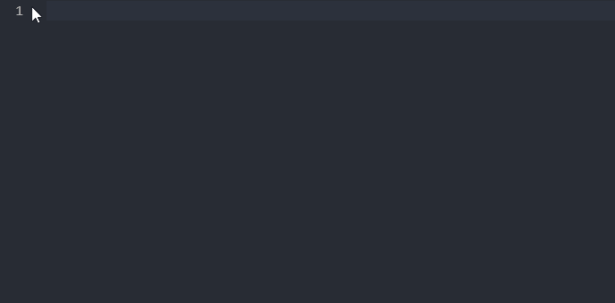
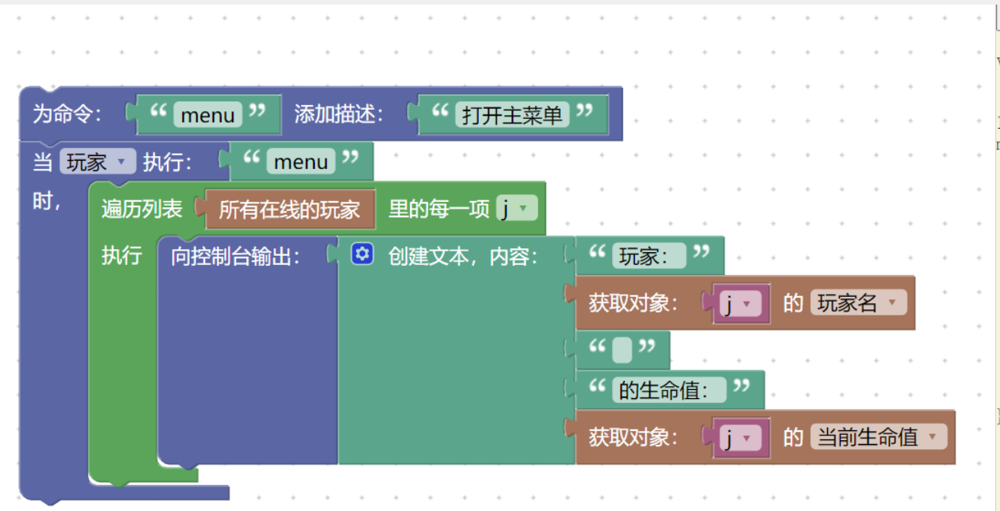

# LiteLoaderBDS - 划时代 x 跨语言BDS插件加载器

[](https://github.com/LiteLDev/LiteLoader/actions)
[](https://discord.gg/27KTrxHc9t)
[](https://t.me/liteloader)
[


](https://github.com/LiteLDev/LiteLoader/releases/latest)

##### [English](README.md) | 简体中文


`LiteLoaderBDS` 是一个非官方的 `Minecraft` 服务端插件加载器，为基岩版官方服务端`Bedrock Dedicated Server`（以下简称**BDS**）提供插件开发支持 和 插件加载服务，弥补了官方行为包开发接口长期以来存在的一些不足。

`LiteLoader` 提供了海量的API、强大的事件系统以及大量封装的开发基础设施接口，为拓展基岩版**BDS**的更多玩法和功能提供了坚实的基础。通过插件，可以很容易地拓展BDS的功能，相关开发易于学习，且开发方式比较灵活。

项目支持使用 **C++，Golang，JavaScript，Lua，Python** 等各种语言编写插件。同时，插件不需要随着**BDS**版本更新而不断修改代码，仅需本项目在底层适配更新即可，给插件开发与维护带来了很大的便利。  

## 🎁 第一印象

> “为什么我应该选择LiteLoader？”  
> 易于使用，直观的接口！

#### C++语言示例插件

```c++
#include <EventAPI.h>
#include <LoggerAPI.h>
#include <LLAPI.h>
#include <MC/Player.hpp>
#include <MC/Actor.hpp>
Logger logger("AttackLog");

void PluginInit()
{
	LL::registerPlugin("PluginName", "Introduction", LL::Version(1, 0, 0));
    logger.info("插件 xxx 已加载.");
    //监听玩家攻击事件
    Event::PlayerAttackEvent::subscribe([](const Event::PlayerAttackEvent& ev) {
        Player* player = ev.mPlayer;
        Actor* actor = ev.mTarget;
        logger.info(u8"玩家:{} 攻击了 {} | 坐标 {} 维度 {}", 
        	player->getRealName(), actor->getTypeName(), actor->getPos().toString(),
            std::to_string(actor->getDimensionId()));
        return true;
    });
}
```

#### 脚本语言示例插件

```javascript
// 注册关服命令
mc.listen("onServerStarted", () => {
    const cmd = mc.newCommand("stopsvr", "关闭服务器", PermType.GameMasters);
    cmd.overload();
    cmd.setCallback((_cmd, ori, out, _res) => {
        const pl = ori.player;
        out.success("关服命令执行成功");
        mc.broadcast(`玩家${pl.realName}执行了关服命令。服务器将在5秒之后关闭`);

        //执行关服命令
        setTimeout(() => {
            mc.runcmd("stop");
        }, 5000);
    });
    cmd.setup();
});
```

<br/>

## 💎 优势

- 💻 支持多种不同的语言开发插件，保持接口统一

| 目前已支持的插件开发语言   | `C++`，`Golang`，`JavaScript`，`Lua` |
| -------------------------- | ------------------------------------ |
| **即将支持的插件开发语言** | `Python`，`Ruby`，`C#`，`TypeScript` |

- 📕 开发体验流畅，兼容性强
  - 拥有自动生成的C++头文件，可以访问`BDS`所有的类和功能，拥有完善的工具链支持，且功能不断发展中
  - 对于脚本语言插件，拥有多语言代码补全库、强大的VSCode插件、热加载系统 ......众多辅助工具，帮你更有效地写好每一行代码
  - 版本更新时，将保证 API 基本 **向下兼容**，插件几乎不需要随版本更新而修改代码。`LiteLoader`系列独有符号查找技术，跨版本 **自动适配** 不再是梦想


- 📋 开发文档完善，讲解详细
  - 欢迎 👉[移步 LiteLoader 文档站](https://docs.litebds.com/)👈 查看更多  

- 🎈 大量封装完善的的接口
  - 拥有众多游戏API支持：玩家，实体，方块，物品，容器，NBT，服务器系统……
  - 多达 **五十多种** 游戏事件监听，不管什么事情发生，都可以第一时间响应

- 🛡 安全，稳定，通用
  - 修复BDS中的一些漏洞，确保您的服务器的稳定性和安全性  
  - 广泛使用SEH异常保护框架，将服务器崩溃的风险降到最低
  - 支持通过 **Wine** 在Linux、MacOS平台运行，给其他平台也带来自由的插件体验：一次编写，**多平台共享**

- 🏆 应用生态健全
  - 海量现有插件，成熟发布平台，即刻 👉[前往MineBBS](https://www.minebbs.com/resources/?prefix_id=67)👈 查找并下载你喜欢的 LL 插件  
- 🏃 开源 & 社区共建
  - 项目采用 `GPL-3.0` 开源许可证，**永远不会** 收费或者推出商业版。  
  - 设计思想采取 **去中心化** 设计，放心享受 **自由** 的插件加载框架！  

------

## 💻 安装

### 对于 Windows 用户

1. 前往 [MineBBS](https://www.minebbs.com/liteloader/) 或 [GitHub Release](https://github.com/LiteLDev/LiteLoader/releases) 下载最新的 `LiteLoader-版本号.zip`
2. 将压缩文件内的所有内容解压到 `bedrock_server.exe` 所在的目录。如果解压的过程中提示文件有冲突，选择覆盖即可。
3. 保证 `bedrock_server.pdb`文件存在。  
   运行 `SymDB2.exe` 来生成符号文件（`bedrock_server.symdb2`）和有导出符号的BDS（`bedrock_server_mod.exe`）  
4. 当控制台输出 `请按任意键继续. . . ` 时，按任意键关闭窗口
3. 运行 `bedrock_server_mod.exe` 开服

### 对于 Linux 用户

#### 安装脚本

```
wget https://github.com/LiteLDev/LiteLoaderBDS/raw/beta/Scripts/install.sh
chmod +x install.sh
./install.sh
```

#### Docker

在终端中输入：
```
docker pull shrbox/liteloaderbds
docker create --name liteloader -p 19132:19132/udp -i -t shrbox/liteloaderbds
```
启动服务器：`docker container start liteloader`  
强制停止服务器（不推荐）：`docker container stop liteloader`  
进入控制台：`docker attach liteloader`  
退出控制台：按下 `Ctrl + P + Q`。如果按下 `Ctrl + C`，服务器进程将会终止。  
如想管理服务端文件，使用命令 `docker volume --help` 了解详情。  

## 🎯 下载 & 加载插件

### 插件的下载

`LiteLoader`主要插件发布渠道：

- MineBBS论坛：[点击这里 前往发现更多](https://www.minebbs.com/resources/?prefix_id=59)
- GitHub Discussion：[Discussions · LiteLDev/LiteLoaderBDS](https://github.com/LiteLDev/LiteLoaderBDS/discussions)

### 插件的安装

1. 如果下载到的是一个压缩包文件，请解压它
2. 将所有获取到的内容直接放入`plugins`目录
3. 运行`bedrock_server_mod.exe` 开服

更多**安装与使用指南** ，请👉[移步 LiteLoader 文档站](https://docs.litebds.com/#/zh_CN/Usage/)👈查看

## 📥 自动更新

从`2.0.0`版本开始，LiteLoader增加了自动更新功能  
如果BDS版本相同，LiteLoader的更新将会**自动推送**，并且**自动在下一次服务端开启时安装**  
第一时间获取最新功能更新！ 免去重复手动升级的烦恼~

你也可以在控制台使用 `ll upgrade` 命令手动检查更新。

<br/>

------

## 📕 LiteLoader 插件开发

### 使用 C++ 开发插件

1. 前往 [LiteLoader 插件模板仓库](https://github.com/LiteLDev/PluginTemplate) 下载项目模板，或者根据模板创建自己的项目仓库，并下载代码到本地
1. 打开 Template.sln 项目文件
1. 在Plugin.cpp中开始编写插件代码
1. 编译生成，并按提示选择相应的PDB文件以生成依赖库lib
1. 复制插件到 plugins 目录进行测试

具体插件开发示例与指导，请👉[移步 LiteLoader 文档站](https://docs.litebds.com/#/zh_CN/Usage/)👈查看  
如果有修订需求或者有新增API的需要，欢迎联系作者或者发布Issue  

### 使用脚本语言开发插件

1. 创建文件
2. 编写代码
3. 复制插件到 plugins 目录进行测试

请👉[移步 LiteLoader 文档站](https://docs.litebds.com/#/zh_CN/Development/)👈查看详细的**API文档**和**插件开发教程**  
如果有修订需求或者有新增API的需要，欢迎联系作者或者发布Issue  

### 示例插件

[点击这里](https://github.com/LiteLDev) [点击这里](https://github.com/LiteLDev-LXL) 查看更多开源的 LiteLoader 插件，作为示例插件。  
你可以直接在生产环境中使用它们
也可以在这里学习插件开发的方法和技巧

<br>

### 开发辅助工具 - VSCode 开发辅助插件 & 补全库

使用 Moxicat 开发的 LiteLoader 开发辅助插件
帮助你更好地完成**脚本插件**的开发！  
代码提示、自动补全、自动文档、错误提醒、运行时调试。。。。
只有你想不到，没有他做不到  
用过绝不后悔的顶级插件开发体验！



[点击这里](https://www.minebbs.com/resources/lxldevhelper.2672/)
查看扩展说明与介绍  
VSCode扩展商店搜索`LXL`，安装**LXLDevHelper**，即刻体验

<br>

### 开发辅助工具 - Blockly-LXL 图形化开发套件

没有编程基础？对复杂的语言规则感到厌烦？  
你有没有想过，BDS插件开发可以像拼图一样容易？

看这里！pa733的 Blockly-LXL 图形化开发套件，将插件开发体验提升到了新的高度



[点击这里](https://www.minebbs.com/resources/blockly-lxl.2671/)
查看相关安装与使用说明

<br>

### 开发辅助工具 - CommonJs  for LXL

CJS.JS作者是callstackexceed，这个插件为在LXL下使用Js开发插件提供了大家熟知的CommonJS接口，方便Js插件的模块化设计


[点击这里](https://github.com/callstackexceed/cjs.js) 前往GitHub查看使用说明，并下载使用

项目作者callstackexceed，也是MC addon `NormaConstructor`的一个开发者。  
`NormaConstructor`是一个开源的快速建造（类WorldEdit）插件，目前运行在Scripting API和LXL上。  
NC不仅需要用户，也需要开发人员。欢迎大家在 [MineBBS](https://www.minebbs.com/resources/integral-worldedit-liteloader.2738/) 和 mcpedl 关注 `NormaConstructor` 的相关进展

<br/>

------

## 🔨 构建项目

> 前往 [`GitHub Actions`](https://github.com/LiteLDev/LiteLoaderBDS/actions) 来获取最新的构建工件(artifact)
>   
> 当然，如果您愿意自己构建项目，或者向 LiteLoader 贡献代码，您可以按照以下说明自行构建项目

1. 安装最新的 **Microsoft Visual Studio** 和标准的 C++ 桌面开发套件
2. 安装最新的 **Windows SDK**
3. 打开 `LiteLoader.sln` 项目文件，点击 **生成** 菜单中的 **批生成** 项
4. 弹出批生成对话框，选中对话框右侧所有的生成复选框
5. 选择完毕之后，点击对话框中的 **生成** 按钮，进行批生成
6. 编译生成成功之后，返回到项目根目录，执行 Scripts 文件夹中的 `PackRelease.cmd` 脚本  
   执行完之后，根目录 `RELEASE` 文件夹内的内容即为完整的 `LiteLoader` 环境及所有的依赖库

<br/>

## 🎬 参与贡献

您可以使用以下方法为 `LiteLoader` 项目做出贡献

1. 贡献代码，维护项目和符号
2. 帮助我们修改并优化开发文档
3. 按照格式写下你想要的新API并提交一个PR（GitHub Issue），或者提出好的建议
5. 帮助我们推广 `LiteLoader`，支持我们的发展

⭐⭐⭐我们欢迎您的贡献！⭐⭐⭐

PS：如果你有意为LL贡献代码，欢迎👉[移步 LiteLoader 文档站](https://docs.litebds.com/#/zh_CN/Maintance/)👈查看 **项目维护与支持文档**  

------

## 📍 许可证

您必须接受 Minecraft 的最终用户许可协议(EULA).

- 它意味着**请勿将任何违反 EULA 的内容用于商业用途**
- 接受这个**许可证**意味着您也**接受了**[Minecraft EULA](https://account.mojang.com/terms)
- 如果您违反了 **EULA**，任何法律责任都与开发者**无关**
- **开发者不对您负责，开发者没有义务为你编写代码、为你使用造成的任何后果负责**

另外，您需要遵守本项目的`GPL-3.0`开源许可证条款，以及下列提到的各关联项目的开源许可证条款

[LiteLoader](https://github.com/LiteLDev/LiteLoader) GPLv3以及额外限制和例外  
[BedrockX](https://github.com/Sysca11/BedrockX) GPLv3以及额外限制和例外   
[ElementZero](https://github.com/Element-0/ElementZero) GPLv3  
[ScriptX](https://github.com/Tencent/ScriptX) Apache License Version 2.0    
[ChakraCore](https://github.com/chakra-core/ChakraCore) MIT License  
[OpenSSL](https://github.com/openssl/openssl) Apache-2.0 License  
[SimpleIni](https://github.com/brofield/simpleini) MIT License  
[Nlohmann-Json](https://github.com/nlohmann/json) MIT License  
[nbt-cpp](https://github.com/handtruth/nbt-cpp) MIT License  
[Hash](https://github.com/Chocobo1/Hash) GPL v3    
[ThreadPool](https://github.com/jhasse/ThreadPool) Zlib License    
[LightWebSocketClient](https://github.com/cyanray/LightWebSocketClient) MIT License
[magic_enum](https://github.com/Neargye/magic_enum) MIT License
[dyncall](https://www.dyncall.org/index) ISC license

### 额外限制和例外

如果你提供服务器托管服务，你可以免费使用这个框架，但你不应该对这个框架进行私下更改或者作为卖点。去除版权以及赞助商的信息是一件非常可耻的事情！如果您修复或调整了代码，请提交PR，而不是将其设为私有或用于商业用途。
> 不要作恶。

虽然我们期望建立一个开源社区，但是强迫一切开源会毁了这个社区。 因此，您可以使用任何开源许可证编写基于"LiteLoader"的插件，甚至不发布您的源代码。 但是如果你修改了框架或者基于这个框架编写了一个新的框架，你必须开源它。

## 🏆 致谢

- LiteLDev 开发组全体成员对项目的巨大贡献
- 开源 [ScriptX](https://github.com/Tencent/ScriptX) 项目提供的跨语言脚本引擎支持
- ScriptX开发者 [@LanderlYoung](https://github.com/Tencent/ScriptX/commits?author=LanderlYoung) 在开发过程中给予的很多帮助
- [LiteLuaLoader](https://github.com/wzyyyyyyy) 项目 和 [BDSPyRunner](https://github.com/twoone-3/BDSpyrunner) 项目 提供的很多底层接口实现
- 感谢整个BDS开源社区为相关技术发展添砖加瓦

#### 重要贡献者

|  |  |  |  |  |  |  |  |
|:--------------------------------------------------------------------:|:--------------------------------------------------------------------------:|:-----------------------------------------------------------------------:|:-----------------------------------------------------------------:|:---------------------------------------------------------------------:|:-----------------------------------------------------------------------:|:---------------------------------------------------------------------:|:------------------------------------------------------------------------:|
|                 [@ShrBox](https://github.com/ShrBox)                 |              [@dreamguxiang](https://github.com/dreamguxiang)              |               [@WangYneos](https://github.com/WangYneos)                |               [@wzy](https://github.com/wzyyyyyyy)                |                [@xiaoqch](https://github.com/xiaoqch)                 |               [@yqs112358](https://github.com/yqs112358)                |                [@Sysca11](https://github.com/Sysca11)                 |               [@RimuruChan](https://github.com/RimuruChan)               |

**感谢 [JetBrains](https://www.jetbrains.com/) 给开源开发者分配免费的IDE许可证，例如 [CLion](https://www.jetbrains.com/clion/)** 。

[](https://www.jetbrains.com/)

<br>

## 📞 联系我们

LiteLoader QQ交流群：656669024 [点击加入](https://jq.qq.com/?_wv=1027&k=lagwtrfh)  
LiteLoader QQ交流2群：850517473 [点击加入](https://jq.qq.com/?_wv=1027&k=zeUbrETH)    
Discord 频道：#LiteLoaderBDS  [点击加入](https://discord.gg/4tBQHc9u7p)  
Telegram 频道：#LiteLoader [点击加入](https://t.me/LiteLoader)

欢迎反馈崩溃和版本适配问题，以及参与相关技术讨论与交流

## 💕赞助作者💕

项目已接入爱发电 [赞助我们(爱发电)](https://afdian.net/@liteldev) [赞助我们(爱发电)](https://afdian.net/@LiteXLoader?tab=home)    
Patreon Sponser [Click Here](https://www.patreon.com/litexloader) 
