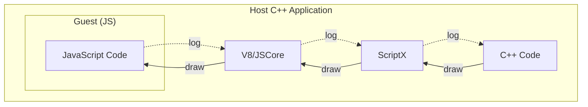
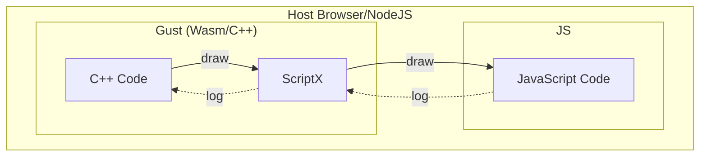
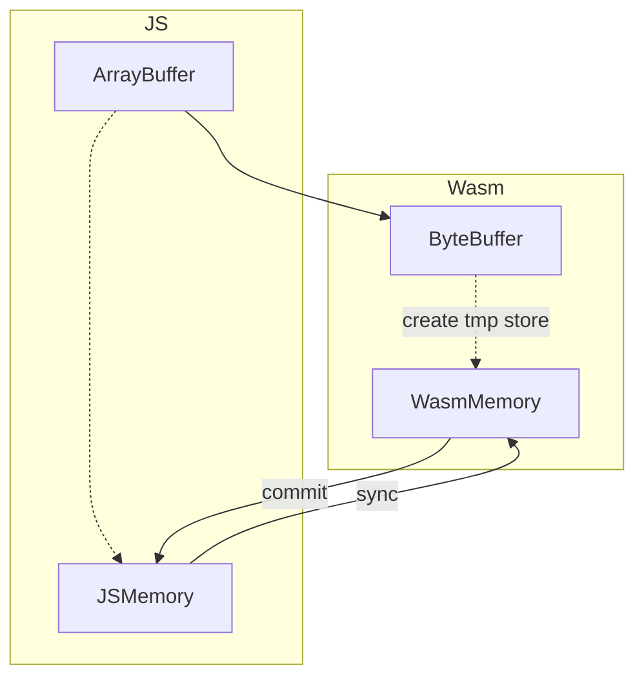
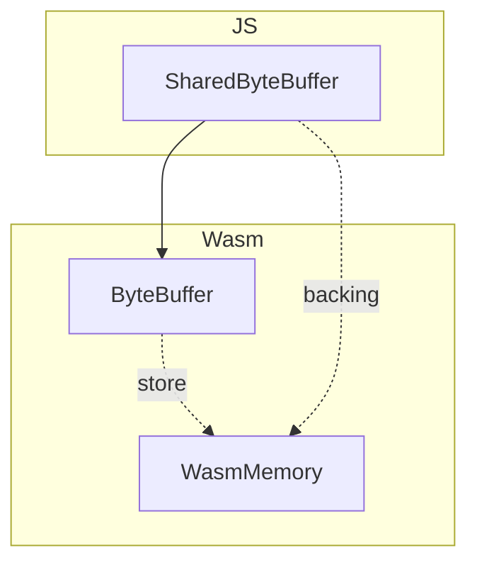

# WebAssembly 实现细节及使用须知

[TOC]

WebAssembly的实现不同于V8和JSCore，主要体现在于：

1. V8/JSCore是作为JS的Host，提供了一套JS的运行环境，而WebAssembly则是作为Guest，运行在JS环境之内（此时JS变成了Host）
2. WebAssembly规范仍在完善中，一些V8/JSCore提供的能力在这里并未实现。

## 身份的转变

这样的一个从主人到客人的转变带来了这些变化。

举个栗子，假设一个场景，C++需要调用js的`draw`方法，js则需要调用C++的`log`方法。

**V8/JScore**:



**WebAssembly**:



在V8和JSCore的场景下，C++代码作为应用程序的主体，JS则是作为内嵌在应用程序里的一个子环境，我们可以创建多个`ScriptEngine`来创建多个JS子环境。

但是在WebAssembly的场景下则刚好反了过来。

这个带来的影响就是，**在 WASM 下，`ScriptEngine` 是一个单例**（因为外部的JS环境只有一个）。

> PS: `ScriptEngine@wasm` 暂时不支持destroy。因为没有足够的理由去做这个操作。

## GC

Wasm没有GC，JS也没有finalize回调。。。所以就很坑爹

只能手动管理内存。和ScriptX相关的主要包含两个方面：
1. ByteBuffer内存的释放（下文详述）
2. 绑定类的内存释放

### 绑定类的内存释放
在V8和JSCore中，依赖引擎提供的finalize回调，实现了绑定类的自动释放，但是在WASM中就搞不定了，使用者只能自己释放之。ScriptX在JS全局提供了辅助方法。

举个栗子：

```C++
static ClassDefine<Test> test =
    defineClass<Test>("Test")
        .constructor()
        .build();

EngineScope scope(engine);
engine->registerNativeClass(test);

auto ins = engine->newNativeClass<Test>();
// C++ api to destroy
wasm_interop::destroyScriptClass(ins);
```

```JS
const test = new Test();
// JS API to destroy
ScriptX.destroyScriptClass(test);
```

### WeakReference

自然也是没法实现的，所以目前所有的`script::Weak`都是强引用实现。。。

### GC 杂谈

PS：事实上最新的Chrome（V8）和FireFox已经实现了`WeakRef`和`FinalizationRegistry` API，但是Safari（iOS）还没有相关实现；而且稍老的V8和FireFox也没有相关实现。所以暂时不考虑他们。

期待WASM的GC proposal赶紧实现。

相关文档：
1. https://developer.mozilla.org/en-US/docs/Web/JavaScript/Reference/Global_Objects/FinalizationRegistry
2. https://v8.dev/features/weak-references

## ByteBuffer

因为主客身份的转换，导致WASM的内存模型和其他的引擎都不一样。

为了模拟C++等程序的“堆内存”概念，在WASM中会创建一个巨大的`ArrayBuffer`作为其memory；而指针则直接变成了`ArrayBuffer`的index。另外如果配置了，允许内存增长（emscrpten中使用配置`-sALLOW_MEMORY_GROWTH=1`），则有可能会重新创建一个更大的`ArrayBuffer`并把老的内容copy过来。

ScriptX这这里的实现上做了很多考量，最终得出如下结论：

1. 不可以从JS创建的`ArrayBuffer`获取一个指针，并往里读写内容，因为从WASM的角度看，他们不在当前“进程”的内从空间里，这样的话，copy不可避免！
2. 可以从WASM分配内存，传给JS共享使用，避免copy。

对于这样的结论，再经过更深入的思考，得出了ScriptX ByteBuffer的实现：
1. 为兼容从JS传过来的ArrayBuffer，在WASM中开辟一段内存，作为copy，并提供操作同步两者的内容。这个能力主要为了提供从JS传数据过来的能力，兼容性为主，性能为辅。
2. 为了提高性能，避免copy。实现接口从ScriptX分配内存，传递到JS侧直接使用。这个能力则更关注性能，对易用性有一定要求。

### 内存copy -- 非共享 `ByteBuffer`

这里是将JS创建的`ArrayBuffer`, `DataView`, `TypedArray` 传递给ScriptX的情况。




从JS创建的 `ArrayBuffer` 读写内容：

0. 创建 `Local<ByteBuffer>` (比如调用 `Local<Value>::asByteBuffer()`)
1. malloc内存 -- ptr
2. copy js的 `ArrayBuffer` 到 ptr
3. `Local<ByteBuffer>::getRawBytes()` 直接返回ptr
4. C++ 读写ptr
5. C++ 使用 `Local<ByteBuffer>::commit` 将ptr的内容copy回`ArrayBuffer`
6. C++ 使用 `Local<ByteBuffer>::sync` 将`ArrayBuffer`的内容copy到ptr
5. `Local<ByteBuffer>` 析构，主动调用`commit`并释放ptr

举个栗子：

```cpp
{
    // 底层会创建一个ArrayBuffer
    auto b = ByteBuffer::newByteBuffer(16);
    // 底层会malloc内存，并copy过来
    auto ptr = b.getRawBytes();
    read(ptr);

    write(ptr);
    // 主动copy过去，否则JS的ArrayBuffer看不到新内容
    b.commit();
    // 当然如果不会在中间过程使用ArrayBuffer
    // b析构的时候也会commit过去
}

// 误区：
// 这个用法在WASM下有问题，因为中间变量ByteBuffer已经析构了，所以ptr这时候是个野指针。
auto ptr = value.asByteBuffer().getRawBytes();

// 这个用法就没问题
Function::newFunction([](const Local<ByteBuffer>& buf) {
    auto ptr = buf.getRawBytes();
});


auto sharedPtr = value.asByteBuffer().getRawBytesShared();
// 看情况，虽然sharedPtr不是野指针了，但是因为ByteBuffer已经析构
// 理论上这个sharedPtr只能读，写操作不能再commit回ArrayBuffer了

```

总结创建非共享`ByteBuffer`的方法：
1. JS创建ArrayBuffer传递到ScriptX
2. 使用 `ByteBuffer::newByteBuffer(size_t size)`
3. 使用 `ByteBuffer::newByteBuffer(void* nativeBuffer, size_t size) `


### 共享 `ByteBuffer`

这里是将WASM创建的内存传递给JS的情况。可以避免内存copy。




大致流程：
1. 创建SharedByteBuffer
2. 内部malloc内存 -- ptr
3. 将指针传递给js （作为number类型）
4. js通过`new Int8Array(wasm.memory.buffer, ptr, length)`创建一个`TypedArray`读写之

其中`wasm.memory.buffer`就是WASM“进程”的堆内存，这样就做到了内存的共享，在JS中也可以直接读写ptr了。

总结创建共享`ByteBuffer`的方法：
1. 使用`::script::wasm_interop::newSharedByteBuffer(size_t size)`
2. 使用 `ByteBuffer::newByteBuffer(std::shared_ptr<void> nativeBuffer, size_t size)`
3. JS使用 `new ScriptX.SharedByteBuffer(length)` 创建

### 在js中使用SharedByteBuffer

上述`SharedByteBuffer`在JS中实际上的类型是`ScriptX.SharedByteBuffer`的实例。该类比较简单，使用TypeScript风格描述如下：

```JS
class SharedByteBuffer {
    // 这三个属性和TypedArray保持一致
    readonly buffer: ArrayBuffer;
    readonly byteOffset: number;
    readonly byteLength: number;

    // 手动内存管理，销毁该类，并释放WASM的内存
    public destroy(): void;
}
```

注意上面的buffer属性，如上文所述，当WASM `grow_memory` 的时候，底层的`ArrayBuffer`可能会变，因此使用`SharedByteBuffer`的时候要即时创建`TypedArray`，不要保留引用长期使用（当然你可以配置wasm不grow_memory，或者使用`SharedArrayBuffer`，这样buffer属性一定不会变，具体还是取决于你的使用场景）。

最后还是因为WASM 没有GC, JS 没有finalize，因此这段内存需要使用者自己去释放。可以使用上述`destroy`方法，也可以使用`ScriptX.destroySharedByteBuffer`。C++代码使用`wasm_interop::destroySharedByteBuffer`。

举个栗子：

```js
// CPP
Local<Function> drawImage = Function::newFunction([](const Local<ByteBuffer>& buffer) {
    void* pixelData = buffer.getRawBytes();
    performDraw(pixelData, buffer.size());
});

// JS
const buffer = new ScriptX.SharedByteBuffer(1024);
fillPixelData(new Int8Array(buffer.buffer, buffer.byteOffset, buffer.byteLength));
drawImage(buffer);
// remember to release
buffer.destroy();

```

### PS：判断一个 `Local<ByteBuffer>` 是不是shared
JS中直接instanceof `ScriptX.SharedByteBuffer` 即可。
C++中使用 `Local<ByteBuffer>::isShared`判断之。

当然，如果你C++代码把一个SharedByteBuffer 当成 non-shared 用也不会出问题，毕竟commit和sync操作是no-op。（但是反过来不成立）

## 编译 C++ 到 WASM

这里不做过多介绍，关于WASM的知识还请读者自行阅读
1. https://emscripten.org/
2. https://webassembly.org/
3. https://developer.mozilla.org/en-US/docs/WebAssembly
4. 推荐 https://developer.mozilla.org/en-US/docs/WebAssembly/Understanding_the_text_format

PS：MDN的文档非常良心，不习惯英文的读者可以选择中文语言。

这里提一句怎么用emscrpten编译cmake工程
1. 安装[emsdk](https://github.com/emscripten-core/emsdk)
2. 按照emsdk教程安装emscripten
3. cmake工程设置toolchain即可
`-DCMAKE_TOOLCHAIN_FILE=<emsdk>/upstream/emscripten/cmake/Modules/Platform/Emscripten.cmake`

## WASM 异常
目前WebAssembly不支持异常，emscrpten使用了不太高性能的方法实现了异常。

https://github.com/emscripten-core/emscripten/issues/12475
[Exception handling in emscripten: how it works and why it’s disabled by default](https://brionv.com/log/2019/10/24/exception-handling-in-emscripten-how-it-works-and-why-its-disabled-by-default/)

所以emscrpten提供了一个选项`-sDISABLE_EXCEPTION_CATCHING=0`来打开异常处理。
另外有一个`-sDISABLE_EXCEPTION_CATCHING=2`来针对部分函数打开异常处理。（详见官方文档）

ScriptX的配置是

```C
target_compile_options(ScriptX PRIVATE
        -sDISABLE_EXCEPTION_CATCHING=0
        )
target_link_options(ScriptX INTERFACE
        -sDISABLE_EXCEPTION_CATCHING=0
        )
```

ScriptX 内部所有函数都允许异常处理，顺便把最终产物的link-options设置好了。

使用者还需要针对自己的情况配置是否允许异常处理。

比如在单元测试中也需要异常，所以有这样的配置

```C
if (${SCRIPTX_BACKEND} STREQUAL ${SCRIPTX_BACKEND_WEBASSEMBLY})
    target_compile_options(UnitTests PRIVATE
            -sDISABLE_EXCEPTION_CATCHING=0
            )
endif ()
```

如果不这么设置，你会发现C++代码明明有catch，结果异常还是被抛到外面去了。

## 多线程

WASM目前有多线程的proposal，而且新的Chrome和FireFox都已经实现了，但是从实现原理上看，线程是用WebWorker来承载的，只不过`wasm.memory`是使用`SharedArrayBuffer`来做内存共享。

因此在worker线程里，请不要使用ScriptX，因为worker里面和主线程是两个JS环境，而ScriptX在WASM里其实就是HOST JS环境的封装。

在ScriptX里面有代码做检查，EngineScope 检查“**只能在创建该ScriptX的线程使用该ScriptX**”。

这就导致了在worker线程使用ScriptX其实和主线程的ScriptX环境完全不一样（JS环境不同）。

> 思考：在多线程场景下是否就可以考虑ScriptX每个worker线程一个实例了呢？

**如何在emscrpten中开启worker**
https://emscripten.org/docs/porting/pthreads.html
https://github.com/emscripten-core/emscripten/issues/8503

compile&link flag都增加`-pthread`
如果遇到问题，link flag再增加`-Wl,--shared-memory,--no-check-features`
可选，link flag`-sPTHREAD_POOL_SIZE=4`

## MessageQueue

Wasm作为JS的guest环境，事实上并不需要自己再实现MessageQueue了，因为JS已经有自己的事件循环了。

这种情况下你的代码仍然可以继续使用MessageQueue，但是请不要调用`MessageQueue::loopQueue(LoopType::kLoopAndWait)` 因为这个方法会阻塞JS事件循环。

推荐的方式是`setInterval`一个定时任务，定时的调用`MessageQueue::loopQueue(LoopType::kLoopOnce)`。

```C++
engine->set("eventLoop", Function::newFunction([](const Arguments& args) -> Local<Value> {
    args.engine()->messageQueue().loopQueue(LoopType::kLoopOnce);
    return {};
})

engine->eval("setInterval(eventLoop, 16)");
```

**PS:** 因为MessageQueue是线程安全的，你仍然可以在子线程里面postMessage。

---

written by taylorcyang at 2020-10-16
