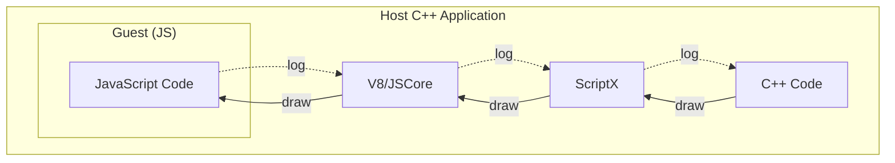
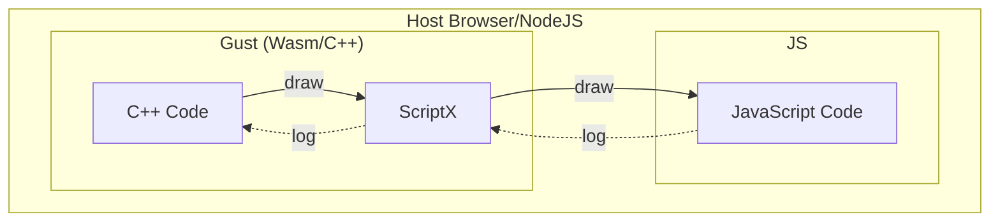
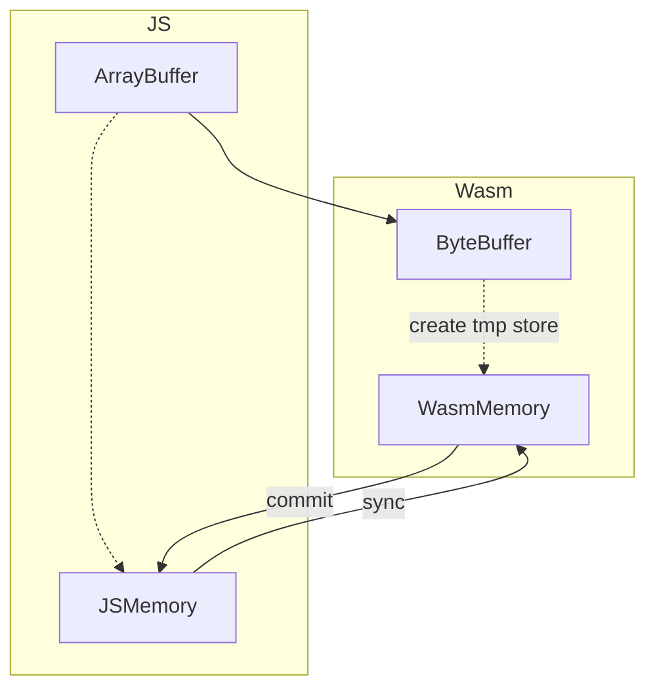
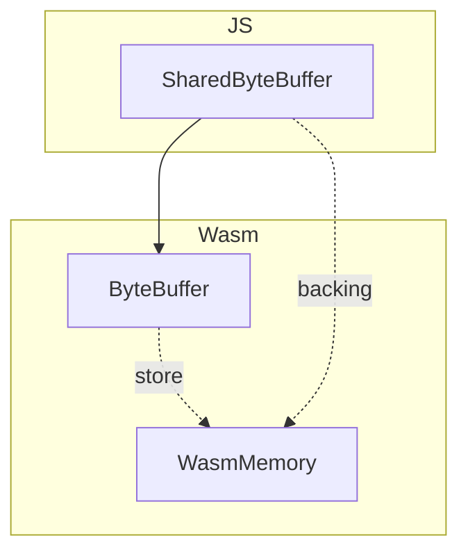

# WebAssembly implementation details and instructions for use

[TOC]

The implementation of WebAssembly is different from V8 and JSCore, mainly in:

1. V8/JSCore is the Host of JS and provides a set of JS operating environment, while WebAssembly is used as the Guest and runs in the JS environment (JS becomes the Host at this time)
2. The WebAssembly specification is still being improved, and some of the capabilities provided by V8/JSCore have not been implemented here.

## Change of Identity

Such a shift from host to guest brought about these changes.

For example, suppose a scenario where C++ needs to call the `draw` method of js, and js needs to call the `log` method of C++.

**V8/JScore**:



**WebAssembly**:



In the scenario of V8 and JSCore, C++ code is the main body of the application, and JS is used as a sub-environment embedded in the application. We can create multiple `ScriptEngine` to create multiple JS sub-environments.

But in the context of WebAssembly, the reverse is true.

The impact of this is that **Under WASM, `ScriptEngine` is a singleton** (because there is only one external JS environment).

> PS: `ScriptEngine@wasm` does not support destroy temporarily. Because there is not enough reason to do this operation.

## GC

Wasm has no GC, and JS has no finalize callback. . . So it's cheating

The memory can only be managed manually. There are two main aspects related to ScriptX:
1. Release of ByteBuffer memory (detailed below)
2. Memory release of bound class

### Binding class memory release
In V8 and JSCore, depending on the finalize callback provided by the engine, the automatic release of the bound class
is realized, but in WASM it is not possible, and the user can only release it by himself. ScriptX provides auxiliary methods in the JS global scope.

For example:

```C++
static ClassDefine<Test> test =
    defineClass<Test>("Test")
        .constructor()
        .build();

EngineScope scope(engine);
engine->registerNativeClass(test);

auto ins = engine->newNativeClass<Test>();
// C++ api to destroy
wasm_interop::destroyScriptClass(ins);
```

```JS
const test = new Test();
// JS API to destroy
ScriptX.destroyScriptClass(test);
```

### WeakReference

Naturally, it is impossible to achieve, so all the current `script::Weak` are implemented by strong references. . .

### GC Miscellaneous

PS: In fact, the latest Chrome (V8) and FireFox have implemented the `WeakRef` and `FinalizationRegistry` APIs, but Safari (iOS) has not yet implemented the relevant implementations; and the older V8 and FireFox also have no relevant implementations. So ignore them for the time being.

I look forward to the implementation of WASM's GC proposal as soon as possible.

Related documents:
1. https://developer.mozilla.org/en-US/docs/Web/JavaScript/Reference/Global_Objects/FinalizationRegistry
2. https://v8.dev/features/weak-references

## ByteBuffer

Because of the conversion of host and guest identities, the memory model of WASM is different from other engines.

In order to simulate the "heap memory" concept of programs such as C++, a huge `ArrayBuffer` is created in WASM as its memory; and the pointer becomes the index of `ArrayBuffer` directly. In addition, if it is configured to allow memory growth (using the configuration `-sALLOW_MEMORY_GROWTH=1` in emscrpten), it is possible to recreate a larger `ArrayBuffer` and copy the old content.

ScriptX made a lot of considerations on the implementation here, and finally came to the following conclusions:

1. It is not possible to obtain a pointer from the `ArrayBuffer` created by JS, and read and write content in it, because from the perspective of WASM, they are not in the space of the current "process". In this case, copy is inevitable!
2. Memory can be allocated from WASM and passed to JS for shared use, avoiding copy.

For this conclusion, after more in-depth thinking, came to the realization of ScriptX ByteBuffer:
1. In order to be compatible with the ArrayBuffer passed from JS, open up a section of memory in WASM as a copy, and provide operations to synchronize the contents of the two. This ability is mainly to provide the ability to transfer data from JS, with compatibility first and performance as a supplement.
2. In order to improve performance, avoid copy. The implementation interface allocates memory from ScriptX and passes it to the JS side for direct use. This ability pays more attention to performance and has certain requirements for ease of use.

### Memory copy - non-shared `ByteBuffer`

Here is the case of passing `ArrayBuffer`, `DataView`, and `TypedArray` created by JS to ScriptX.




Read and write content from `ArrayBuffer` created by JS:

1. Create `Local<ByteBuffer>` (such as calling `Local<Value>::asByteBuffer()`)
2. malloc memory - ptr
3. Copy js's `ArrayBuffer` to ptr
4. `Local<ByteBuffer>::getRawBytes()` returns ptr directly
5. C++ read and write ptr
6. C++ uses `Local<ByteBuffer>::commit` to copy the contents of ptr back to `ArrayBuffer`
7. C++ uses `Local<ByteBuffer>::sync` to copy the contents of `ArrayBuffer` to ptr
8. `Local<ByteBuffer>` destructs, actively calls `commit` and releases ptr

Give a chestnut:

```cpp
{
    // The bottom layer will create an ArrayBuffer
    auto b = ByteBuffer::newByteBuffer(16);
    // The bottom layer will malloc memory and copy it over
    auto ptr = b.getRawBytes();
    read(ptr);

    write(ptr);
    // Actively copy the past, otherwise the ArrayBuffer of JS will not see the new content
    b.commit();
    // Of course if you don’t use ArrayBuffer in the middle
    // When b is deconstructed, it will also commit to the past
}

// Misunderstanding:
// This usage is problematic under WASM, because the intermediate variable ByteBuffer has been destructed, so ptr is a wild pointer at this time.
auto ptr = value.asByteBuffer().getRawBytes();

// This usage is fine
Function::newFunction([](const Local<ByteBuffer>& buf) {
    auto ptr = buf.getRawBytes();
});


auto sharedPtr = value.asByteBuffer().getRawBytesShared();
// It depends, although sharedPtr is not a wild pointer, but because ByteBuffer has been destructed
// In theory, this sharedPtr can only be read, and write operations can no longer commit back to ArrayBuffer

```

Summarize the method of creating a non-shared `ByteBuffer`:
1. JS creates ArrayBuffer and passes it to ScriptX
2. Use `ByteBuffer::newByteBuffer(size_t size)`
3. Use `ByteBuffer::newByteBuffer(void* nativeBuffer, size_t size) `


### Sharing `ByteBuffer`

Here is the case of passing the memory created by WASM to JS. Memory copy can be avoided.




General process:
1. Create SharedByteBuffer
2. Internal malloc memory - ptr
3. Pass the pointer to js (as number type)
4. js creates a `TypedArray` to read and write through `new Int8Array(wasm.memory.buffer, ptr, length)`

Among them, `wasm.memory.buffer` is the heap memory of the WASM "process", so that memory sharing is achieved, and ptr can also be read and written directly in JS.

Summarize the method of creating a shared `ByteBuffer`:
1. Use `::script::wasm_interop::newSharedByteBuffer(size_t size)`
2. Use `ByteBuffer::newByteBuffer(std::shared_ptr<void> nativeBuffer, size_t size)`
3. JS uses `new ScriptX.SharedByteBuffer(length)` to create
### Use SharedByteBuffer in js

The actual type of the above `SharedByteBuffer` in JS is an instance of `ScriptX.SharedByteBuffer`. This class is relatively simple, using TypeScript style description as follows:

```JS
class SharedByteBuffer {
    // These three properties are consistent with TypedArray
    readonly buffer: ArrayBuffer;
    readonly byteOffset: number;
    readonly byteLength: number;

    // Manual memory management, destroy this class, and release WASM memory
    public destroy(): void;
}
```

Pay attention to the buffer attribute above. As mentioned above, when WASM `grow_memory`, the underlying `ArrayBuffer` may change, so when using `SharedByteBuffer`, create a `TypedArray` immediately, don’t keep the reference for long-term use (of course you You can configure wasm not to grow_memory, or use `SharedArrayBuffer`, so the buffer attribute will not change, depending on your usage scenario).

Finally, because WASM has no GC and JS has no finalize, the user needs to release this memory. You can use the above `destroy` method, or you can use `ScriptX.destroySharedByteBuffer`. The C++ code uses `wasm_interop::destroySharedByteBuffer`.

Give a chestnut:

```js
// CPP
Local<Function> drawImage = Function::newFunction([](const Local<ByteBuffer>& buffer) {
    void* pixelData = buffer.getRawBytes();
    performDraw(pixelData, buffer.size());
});

// JS
const buffer = new ScriptX.SharedByteBuffer(1024);
fillPixelData(new Int8Array(buffer.buffer, buffer.byteOffset, buffer.byteLength));
drawImage(buffer);
// remember to release
buffer.destroy();

```

### PS: Determine whether a `Local<ByteBuffer>` is shared
Direct instanceof `ScriptX.SharedByteBuffer` in JS.
Use `Local<ByteBuffer>::isShared` to judge it in C++.

Of course, if your C++ code treats a SharedByteBuffer as non-shared, it will not be a problem, after all, the commit and sync operations are no-op. (But the reverse is not true)

## Compile C++ to WASM

I won’t introduce too much here, but readers should read about the knowledge of WASM.
1. https://emscripten.org/
2. https://webassembly.org/
3. https://developer.mozilla.org/en-US/docs/WebAssembly
4. Recommend https://developer.mozilla.org/en-US/docs/WebAssembly/Understanding_the_text_format

PS: MDN's documentation is very good, readers who are not used to English can choose Chinese.

Here is how to compile cmake project with emscripten
1. Install [emsdk](https://github.com/emscripten-core/emsdk)
2. Follow the emsdk tutorial to install emscripten
3. Set the toolchain in cmake project
   `-DCMAKE_TOOLCHAIN_FILE=<emsdk>/upstream/emscripten/cmake/Modules/Platform/Emscripten.cmake`

## WASM exception
Currently WebAssembly does not support exceptions, emscrpten uses a less high-performance method to implement exceptions.

https://github.com/emscripten-core/emscripten/issues/12475
[Exception handling in emscripten: how it works and why it's disabled by default](https://brionv.com/log/2019/10/24/exception-handling-in-emscripten-how-it-works-and-why -its-disabled-by-default/)

So emscrpten provides an option `-sDISABLE_EXCEPTION_CATCHING=0` to turn on exception handling.
In addition, there is a `-sDISABLE_EXCEPTION_CATCHING=2` to turn on exception handling for some functions. (See the official document for details)

The configuration of ScriptX is

```C
target_compile_options(ScriptX PRIVATE
        -sDISABLE_EXCEPTION_CATCHING=0
        )
target_link_options(ScriptX INTERFACE
        -sDISABLE_EXCEPTION_CATCHING=0
        )
```

All functions inside ScriptX allow exception handling, and by the way, set the link-options of the final product.

Users also need to configure whether to allow exception handling according to their own situation.

For example, exceptions are also needed in unit tests, so there is such a configuration

```C
if (${SCRIPTX_BACKEND} STREQUAL ${SCRIPTX_BACKEND_WEBASSEMBLY})
    target_compile_options(UnitTests PRIVATE
            -sDISABLE_EXCEPTION_CATCHING=0
            )
endif ()
```

If you don't set it this way, you will find that the C++ code clearly has a catch, but the result is still thrown outside.

## Multithreading

WASM currently has a multi-threaded proposal, and the new Chrome and FireFox have been implemented, but from the perspective of implementation principles, threads are carried by WebWorker, but `wasm.memory` uses `SharedArrayBuffer` for memory sharing .

Therefore, please do not use ScriptX in the worker thread, because the worker and the main thread are two JS environments, and ScriptX in WASM is actually a package of the HOST JS environment.

There is code to check in ScriptX, EngineScope checks "**This ScriptX can only be used in the thread that created the ScriptX**".

This leads to the fact that using ScriptX in the worker thread is completely different from the ScriptX environment of the main thread (the JS environment is different).

> Thinking: Is it possible to consider one instance of ScriptX per worker thread in a multi-threaded scenario?

**How to start worker in emscrpten**
https://emscripten.org/docs/porting/pthreads.html
https://github.com/emscripten-core/emscripten/issues/8503

compile & link flags are added `-pthread`
If you encounter problems, add `-Wl, --shared-memory, --no-check-features` to the link flag
Optional, link flag`-sPTHREAD_POOL_SIZE=4`

## MessageQueue

As the guest environment of JS, Wasm does not actually need to implement MessageQueue by itself, because JS already has its own event loop.

In this case, your code can still use MessageQueue, but please do not call `MessageQueue::loopQueue(LoopType::kLoopAndWait)` because this method will block the JS event loop.

The recommended way is `setInterval` a timed task, calling `MessageQueue::loopQueue(LoopType::kLoopOnce)` regularly.

```C++
engine->set("eventLoop", Function::newFunction([](const Arguments& args) -> Local<Value> {
    args.engine()->messageQueue().loopQueue(LoopType::kLoopOnce);
    return {};
})

engine->eval("setInterval(eventLoop, 16)");
```

**PS:** Because MessageQueue is thread-safe, you can still postMessage in a child thread.

---

written by taylorcyang at 2020-10-16