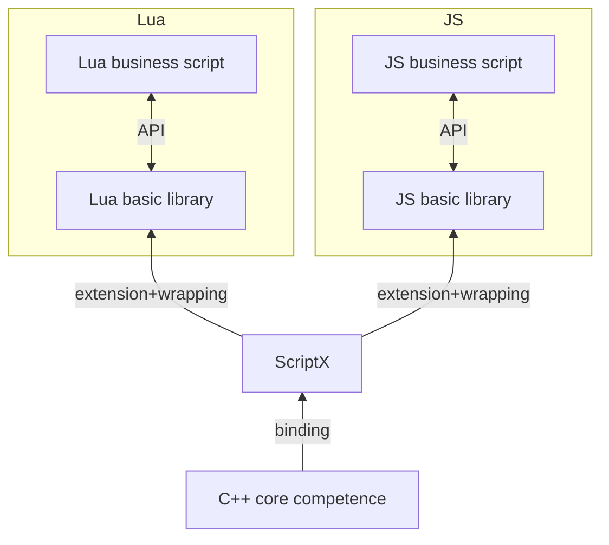

# Inject/bind Native class/method

Here comes a more important topic, how to inject (bind) Native classes and methods into scripts so that they can be used normally.

## Injection/Binding Method
Let’s start with a simple one. When you need to inject a native method, you can use the `script::Function::newFunction` method. The accepted parameter is a `script::FunctionCallback` type, which is `std::function. <void(const Arguments& args)>`, that is, a callback function. When js calls the corresponding method, ScriptX will call this callback function, in this function:

1. There is already EngineScope in the function.
2. In the function, you can throw an exception to the script directly by throwing `script::Exception`.
3. The parameters of the function are obtained by `Local<Value> Arguments::operator[](size_t)`.
4. The return value of the function is passed through `return Local<Value>{xxx}`.

See the exception section above for related examples.

## Injection/Binding Class

The basics of a Class is the same as Method, but the form is different.

There is a template definition in Native.h:

```c++
template<typename T>
struct ClassDefine {
    const std::string className{};
    const std::string nameSpace{};
    const StaticDefine staticDefine{};
    const InstanceDefine<T> instanceDefine{};
    NativeRegister getNativeRegister() const;
}
```

Use `ClassDefine<T>` to describe all the information of a class.

1. Template parameter T: the corresponding class of the script class in C++.
   The instance of the script class corresponds to the instance of T in C++.
   Each time a script class instance is created, a new instance of T will be created in C++.
   When this class has only static methods (class methods) that we cannot create an instance, use void instead of T.
2. className: the name of the class
3. nameSpace: In which namespace this class is located. In JS, such as `nameSpace = "game.ui"; className="ImageView";` then the class will exist in `game.ui.ImageView` in the script, and use `new game.ui.ImageView()`. To cover different languages, the namespace separator char is always a single dot -- `.`.
4. staticDefine: class static method + properties definition
5. instanceDefine: instance method + properties definition of the class
6. getNativeRegister: Since ClassDefine is a template class, it is quite difficult to be stored in a container. 
   Therefore, ClassDefine directly implements a **type erasure** helper class. 
   The `NativeRegister` class is an ordinary class that supports copy and move, and can be used as a pointer.

Register a binding class by calling `ScriptEngine::registerNativeDefine`. It should be noted that the destruction of this ClassDefine is later than ScriptEngine, otherwise there will be a wild pointer problem. The usual practice is to use ClassDefine as a global static variable.

`StaticDefine` contains methods (method name + method callback), properties (property name + property getter + property setter) and binding methods are similar, so no need to repeat.

`InstanceDefine`

```c++
template<typename T>
struct InstanceDefine {
    struct PropertyDefine {... };
    struct FunctionDefine {
        using FunctionCallback = std::function<void(T*, const Arguments& args)>;
        ...
    };
    const Constructor constructor{};
    const std::vector<PropertyDefine> properties{};
    const std::vector<FunctionDefine> functions{};
    const size_t instanceSize = sizeof_helper_v<T>;
};
```

The template parameter T must be a type that inherits `sctipt::ScriptClass`.

`InstanceDefine<T>` has some differences compared to `StaticDefine`. First of all, there is an
additional required param -- `constructor`, which is the callback of the constructor. 
ScriptX will call back to this function when the script side creates a new instance of the class.
This function needs to be created and returns a `T*` pointer. When the corresponding instance is GCed,
ScriptX will **automatically release and destroy `T*`**. In particular, when the constructor
parameters are illegal and the corresponding C++ instance cannot be constructed, you can
consider throwing an exception, or `return nullptr` (ScriptX will throw an exception for you at this time).

Another difference is that the method callback has an additional parameter `T*` which is the C++ instance pointer.
The pointer won't be null and always be the pointer returned by the constructor.

The above `using FunctionCallback = std::function<void(T*, const Arguments& args)>;` With the help of `std::function`, it is possible to bind a function with two parameters `void (*) (T*, const Arguments&)`, can also bind a member function `void (T::*)(const Arguments&)` of class T.

Finally, the above struct is not a public API, but only used to introduce the internal logic. All `ClassDefine<T>` should be constructed by `ClassDeinfeBuilder<T>::build`.

Examples are as follows:

```c++
class TestClass: public ScriptClass {
 public:
  explicit TestClass(const Local<Object>& scriptObj): ScriptClass(scriptObj) {}
  ~TestClass() override = default;
  virtual Local<Value> greet(const Arguments& args);
  Local<Value> age(const Arguments& args);
  Local<Value> getSrc();
  void setSrc(const Local<Value>& value);

  static Local<Value> add(const Arguments& args);
  static Local<Value> getVersion();
  static void setVersion(const Local<Value>& value);
  static TestClass* create(const Arguments& args);
};

const ClassDefine<TestClass> TestClassDefAll =
    defineClass<TestClass>("TestClass")
        .nameSpace("script.engine.test")
        .constructor(&TestClass::create)
        .function("add", &TestClass::add)
        .property("version", &TestClass::getVersion, &TestClass::setVersion)
        .instanceFunction("greet", &TestClass::greet)
        .instanceFunction("age", &TestClass::age)
        .instanceProperty("src", &TestClass::getSrc, &TestClass::setSrc)
        .build();
```

## ClassDefineBuilder API
Create a ClassDefineBuilder by using `script::defineClass<ClasType>(className)`

1. `namespace(std::string)` see above
2. `property(std::string,std::function<Local<Value>()> getter, std::function<void(const Local<Value>& value)> setter)` is used to add a static property
3. `function(std::string, std::function<Local<Value>(const Arguments& args)>)` is used to add a static method
4. `constructor(std::function<T*(const Arguments& args)>)` is used to specify a constructor, see above for details
5. `instanceFunction(std::string, std::function<Local<Value>(T*, const Arguments& args)>)` is used to add an instance method
6. `instanceProperty(std::string, std::function<Local<Value>(T*)> getter, std::function<void(T*, const Local<Value>& value)> setter)` is used Add an instance attribute
7. `build` is used to construct `ClassDefine`, internally checks the validity of the data, and an exception will be thrown if the check fails.

Note that only when the template parameter `T` is not void, that is, when the `ClassDeinfe` is not a static class, methods 4, 5, and 6 can be called.

### API related to ClassDefine<T>

As shown in the example code above, there are three APIs in `ScriptEngine` and `ClassDefine<T>`.

1. newNativeClass: create a classDefine object directly in C++
2. isInstanceOf: Determine whether a `Local<Value>` is an instance of a certain classDefine
3. getNativeInstance: Get the pointer of its C++ object from the instance of classDefine.

Others include multiple overloaded methods of `newNativeClass` to facilitate the use of API.

```c++
const ClassDefine<TestClass>& def();

EngineScope engineScope(engine);
try {
    engine->registerNativeClass<TestClass>(def());

    // 1. static property
    auto version = engine->eval("script.engine.test.TestClass.version");
    ASSERT_TRUE(addRet.isString());

    // 2. new instance
    Local<Value> ins = engine->newNativeClass<TestClass>();
    Local<Value> ret = engine->eval("new script.engine.test.TestClass()");

    // 3. Determine if a Script Value is an instance of ClassDefine
    auto instanceof = engine->isInstanceOf<TestClass>(ret);
    ASSERT_TRUE(instanceof);

    // 4. Obtain C++ class pointer through Script value
    TestClass* ptr = engine->getNativeInstance<TestClass>(ret);

} catch (const Exception& e) {
    ...
}
```

# ScriptClass

If you want to bind an instance class, you must inherit `ScriptClass`. ScriptClass provides some basic operations of a C++ object bound to a script object.

Several APIs that need to be explained include

#### `ScriptClass::getScriptObject`
Get the bound script object.

#### `ScriptClass::getInternalStore`
The usage scenario is that sometimes the binding object needs to hold some other script objects, such as a callback function.

InternalStore is an array referenced by ScriptObject. With this array, we can set any object that needs to be stored. At the same time, there is no need to worry about GC related issues.

#### `ScriptClass::~ScriptClass`
Destructor, ScriptX manages memory and GC and delete the memory (also calls destructor) as need.

ScriptX guarantees that this method must be called on the main thread.

ScriptX does not guarantee that this instance must be destroyed at the same time as ScriptObject GC (may be delayed). In fact, for V8 and JSCore, because both
engines require that no engine-related APIs can be called in finalize, the destruction of their ScriptClass is all posted to MessageQueue.

So when you hold a ScriptClass pointer in C++, you may find that `ScriptClass::getScriptObject` returns null in this time gap.

#### `ScriptClass::ScriptClass(ConstructFromCpp<T>)`
This is another constructor of ScriptClass. The usage scenario is that a certain binding class requires a lot of C++ dependencies when constructing it. In this way, going through another ScriptX will cause a lot of type conversion and troublesome. So provide this constructor, directly use C++new as an instance, and then get the corresponding ScriptObject through `getScriptObejct` and return it to ScriptX.

Please use this competence with extra CAUTION, read the doc in header file with care, otherwise you may face strange crashes (memory issue).

YOU HAVE BEEN WARNED.

```c++

class MyImage: public script::ScriptClass {
 public:
  MyImage(void* canvas): script::ScriptClass(script::ScriptClass::ConstructFromCpp<MyImage>{});
  void drawTo(void* canvas, int x, int y);
};

script::ClassDefine<MyImage> myClassDefine =
    script::defineClass<MyImage>("MyImage")
     .constructor(nullptr)
     .function("newImage", []() -> Local<Value> {
         auto img = new MyImage(Render::getInstance()->canvas());
         return img.getScriptObject();
     })
    .function("newImage2", []() -> MyImge* {
        // With the help of Converter, you can also return the pointer directly, and ScriptX will be converted to the equivalent code above
        return MyImage(Render::getInstance()->canvas());
     })
     .build();
```

# Binding existing C++ classes

Because the binding class needs to inherit from `ScriptClass`, it seems unfriendly to the existing C++ classes?

Fortunately, C++ has multiple inheritance. You only need to write a Wrapper class to inherit both the existing C++ class and `ScriptClass`.

```c++
class BaseClass {
 public:
  int age = 0;
  int num = 1;
  const int length = 180;

  std::string name() {return "Base";}

  int getNum() {return num;}

  void setNum(int n) {num = n;}
};

class BaseClassScriptWrapper: public BaseClass, public ScriptClass {
 public:
  explicit BaseClassScriptWrapper(const Local<Object>& thiz): BaseClass(), ScriptClass(thiz) {}
};

const auto baseWrapperDefine =
    defineClass<BaseClassScriptWrapper>("BaseWrapper")
        .nameSpace("BindBaseClass")
        .constructor()
        .instanceProperty("age", &BaseClass::age)
        .instanceProperty("length", &BaseClass::length) // const property has getter, no setter
        .instanceFunction("name", &BaseClass::name)
        .instanceProperty("num", &BaseClass::getNum, &BaseClass::setNum)
        .build();
```

See [NativeTest](../../test/src/NativeTest.cc) for details

# Binding C++ functions directly

Although the above-mentioned binding API has been relatively easy to use, ScriptX is one step closer,
using modern C++ template meta-programming capabilities, allowing ScriptX to directly bind ordinary C++ functions.

Such as:
```C++
class MyImage: public script::ScriptClass {
 public:
  using script::ScriptClass::ScriptClass;

  static const int age = 0;
  static const char* name() {return "hello world";}

  std::string src;
  int add(int a, int b) {return a+ b;}
};

script::ClassDefine<MyImage> myClassDefine =
    script::defineClass<MyImage>("MyImage")
        .constructor()
        .property("age", &MyImage::age)
        .function("name", &MyImage::name)
        .instanceFunction("add", &MyImage::add)
        .instanceProperty("src", &MyImage::src)
        .build();
```

Note the above, you can even bind member variables directly.

The specific usage principle is that the method **parameter** and **return value** are types that support conversion.

List of supported conversion types:

1. void
2. bool
3. any float type: float double
4. any int type: int8_t uint8_t int16_t uint16_t int32_t uint32_t int64_t uint64_t size_t
5. any string type: string string_view char* char8_t* u8string u8string_view
6. all kind of Local reference
7. any pointer of subclass of ScriptClass

Note 7, in fact, it supports the conversion of all binding classes and class pointers.
For example, `Local<Value>` refers to the binding object of `TestClass`, then it can be directly converted to `TestClass*`

# Custom type converter

You can customize the new type converter, you only need to specialize the template:

```c++
 namespace script::converter {

 template <>
 struct Converter <T, void> {
   // convert custom type T to Local<Value>
   static Local<Value> toScript(T&& value) {...;}
   // convert Local<Value> to custom type T
   static T toCpp(const Local<Value>& value) {...;}
 };

 }
```

See [NativeConverter](../../src/NativeConverter.hpp) for details

See [CustomConverterTest](../../test/src/CustomConverterTest.cc) for details

# Type conversion is used for function calls

ScriptX also adds type conversion capabilities to other commonly used interfaces. Such as:

```c++
Local<Function> func;
func.call({}, "string", 1, classPtr);

Local<Object> obj;
obj.set("hello", 4.13);

Object::newObject(type, "name", false);
```

# Tips: Choice of overloaded functions

When directly binding C++ functions, we often face the situation of C++ function overloading.
Here is a util function to select the appropriate overloaded version.
`script::selectOverloadedFunc`

```c++

int overload(int) {return 0;}
int overload(double) {return 1;}

class X {
 public:
  int overload(int) {return 0;}
  int overload(int&) {return 1;}
  int overload(double) {return 2;}
  int overload(double) const {return 3;}
};

TEST_F(NativeTest, SelectOverloadedFunction) {
  auto o1 = script::selectOverloadedFunc<int(int)>(overload);
  auto o2 = script::selectOverloadedFunc<int(double)>(overload);

  EXPECT_EQ(0, o1(0));
  EXPECT_EQ(1, o2(0.0));

  auto x0 = script::selectOverloadedFunc<int (X::*)(int)>(&X::overload);
  auto x1 = script::selectOverloadedFunc<int (X::*)(int&)>(&X::overload);
  auto x2 = script::selectOverloadedFunc<int (X::*)(double)>(&X::overload);
  auto x3 = script::selectOverloadedFunc<int (X::*)(double) const>(&X::overload);

  X x;
  X* p = &x;
  int i = 0;

  EXPECT_EQ(0, (p->*x0)(0));
  EXPECT_EQ(1, (p->*x1)(i));
  EXPECT_EQ(2, (p->*x2)(0.0));
  EXPECT_EQ(3, (p->*x3)(0.0));
}
```

See [NativeTest](../../test/src/NativeTest.cc) for details

# Tips: Differences in different languages

Different scripting languages have different capabilities. For example, JS does not support overloaded operators, but languages such as Lua and Python allow.

> ScriptX's design philosophy is: only provide common and necessary interfaces.

For example, `ClassDefine` only provides the necessary 5 interfaces: constructor, static properties, static methods, instance properties, and instance methods.
With these five interfaces, theoretically the capabilities are complete.

In response to the problems raised above, ScriptX's solution is:
> Each language provides a set of language-specific basic libraries.



<details>
<summary>graph code</summary>



</details>

From bottom to top:
* ScriptX provides basic binding capabilities to expose C++ core capabilities;
* The user writes a set of language-related **basic libraries to expand capabilities** on top of ScriptX (such as the above operator overloading);
* Finally, the business script will call the basic library and the bound API to achieve its functional requirements.

In this way, the language-related logic is put into the basic library, and the code of the binding part is still universal and unified.