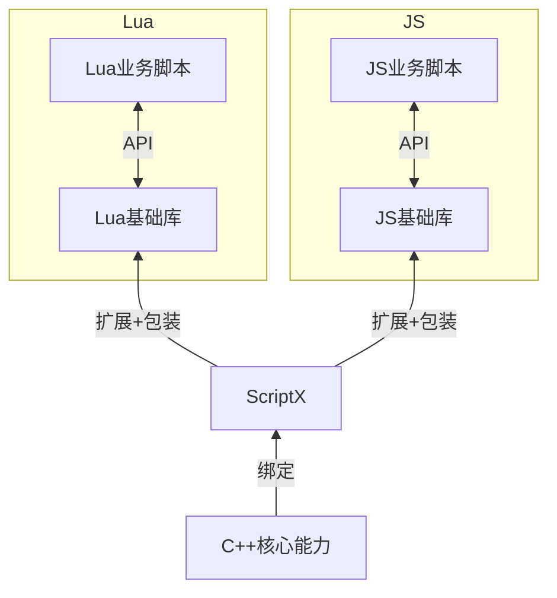

# 注入/绑定 Native实现 类/方法

这里到了一个比较重点的环节，如何将Native 类、方法注入到（绑定）到脚本中，使其能正常使用。

## 注入/绑定 方法
先从简单的说起，当需要注入一个native的方法的时候，可以使用`script::Function::newFunction`方法，接受的参数是一个`script::FunctionCallback`类型，也就是`std::function<void(const Arguments& args)>`，即一个回调函数。当js调用相应方法的时候，ScriptX就会调用这个回调函数，在这个函数里：

1. 函数内已经有EngineScope。
2. 函数内可以直接通过抛出 `script::Exception` 向脚本抛异常。
3. 函数的参数通过`Local<Value> Arguments::operator[](size_t)`获得。
4. 函数的返回值通过`return Local<Value>{xxx}`。

相关例子见上文异常一节。

## 注入/绑定 类

类基本和方法同理，形式不同罢了。

在Native.h中有一个模板定义：

```c++
template<typename T>
struct ClassDefine {
    const std::string className{};
    const std::string nameSpace{};
    const StaticDefine staticDefine{};
    const InstanceDefine<T> instanceDefine{};
    NativeRegister getNativeRegister() const;
}
```

使用 `ClassDefine<T>` 来描述一个类的所有信息。

1. 模板参数T：即该脚本class在C++中对应的类，脚本类的实例和C++中T的实例是一一对应的，每创建一个脚本class实例，C++中都会创建一个新的T的实例。当这个class只有静态方法属性（类方法属性）即不能创建实例的，用void代替T。
2. className：类的名字
3. nameSpace：即这个类在哪个命名空间下。在JS中比如`nameSpace= "game.ui"; className="ImageView";`则该类在脚本中会存在于`game.ui.ImageView`，使用时`new game.ui.ImageView()`. 为了支持多种语言，命名空间的分隔符统一使用英文句号——`.`。
4. staticDefine：类的静态方法+属性定义
5. instanceDefine：类的实例方法+属性定义
6. getNativeRegister: 由于ClassDefine是模板类，在一些需要存储到容器的场景就比较难实现。因此ClassDefine直接实现了一个**类型擦除**的helper类，`NativeRegister`类是一个普通类，支持拷贝和移动，可以当做指针使用。

通过调用 `ScriptEngine::registerNativeDefine` 注册一个绑定类，需要注意这个ClassDefine的销毁要比ScriptEngien晚，否则会出现野指针问题。通常的做法是ClassDefine作为全局静态变量。

`StaticDefine`中包含方法（方法名+方法回调），属性（属性名+属性getter+属性setter）和绑定方法大同小异，这里不再赘述。

`InstanceDefine`

```c++
template<typename T>
struct InstanceDefine {
    struct PropertyDefine { ... };
    struct FunctionDefine {
        using FunctionCallback = std::function<void(T*, const Arguments& args)>;
        ...
    };
    const Constructor constructor{};
    const std::vector<PropertyDefine> properties{};
    const std::vector<FunctionDefine> functions{};
    const size_t instanceSize = sizeof_helper_v<T>;
};
```

模板参数T必须是是继承了`sctipt::ScriptClass`的类型。

`InstanceDefine<T>`相比起`StaticDefine`则要有些区别，首先这里多了个必选项`constructor`，即构造函数的回调。当脚本侧创建class的新实例的时候ScriptX就会回调到这个函数。而这个函数则需要创建，并返回一个 `T*` 指针。当对应的实例被GC的时候，ScriptX会**自动释放并析构`T*`**。特别的，当构造函数参数非法，导致不能构造出相应C++实例时，可以考虑抛异常，或者`return nullptr`（此时ScriptX会帮你抛异常）。

另外一个区别是方法回调多了一个参数`T*`用于回传c++的实例指针，该指针确保不为null，且一定是constructor返回的指针。

上述的`using FunctionCallback = std::function<void(T*, const Arguments& args)>;`借助`std::function`的能力，既可以绑定一个带有两个参数的函数`void (*)(T*, const Arguments&)`，也能绑定一个类T的成员函数`void (T::*)(const Arguments&)`。

最后上述struct并非public API，只是用来介绍内部逻辑，所有的 `ClassDefine<T>`都应该由 `ClassDeinfeBuilder<T>::build` 来构造出来。

示例如下：

```c++
class TestClass : public ScriptClass {
 public:
  explicit TestClass(const Local<Object>& scriptObj) : ScriptClass(scriptObj) {}
  ~TestClass() override = default;
  virtual Local<Value> greet(const Arguments& args);
  Local<Value> age(const Arguments& args);
  Local<Value> getSrc();
  void setSrc(const Local<Value>& value);

  static Local<Value> add(const Arguments& args);
  static Local<Value> getVersion();
  static void setVersion(const Local<Value>& value);
  static TestClass* create(const Arguments& args);
};

const ClassDefine<TestClass> TestClassDefAll =
    defineClass<TestClass>("TestClass")
        .nameSpace("script.engine.test")
        .constructor(&TestClass::create)
        .function("add", &TestClass::add)
        .property("version", &TestClass::getVersion, &TestClass::setVersion)
        .instanceFunction("greet", &TestClass::greet)
        .instanceFunction("age", &TestClass::age)
        .instanceProperty("src", &TestClass::getSrc, &TestClass::setSrc)
        .build();
```

## ClassDefineBuilder 的API
通过使用 `script::defineClass<ClasType>(className)`来创建一个 `ClassDefineBuilder`

1. `namespace(std::string)` 见上文
2. `property(std::string,std::function<Local<Value>()> getter, std::function<void(const Local<Value>& value)> setter)` 用于添加一个静态属性
3. `function(std::string, std::function<Local<Value>(const Arguments& args)>)` 用于添加一个静态方法
4. `constructor(std::function<T*(const Arguments& args)>)` 用于指定一个构造函数，详见上文
5. `instanceFunction(std::string, std::function<Local<Value>(T*, const Arguments& args)>)` 用于添加一个实例方法
6. `instanceProperty(std::string, std::function<Local<Value>(T*)> getter, std::function<void(T*, const Local<Value>& value)> setter)` 用于添加一个实例属性
7. `build` 用于构造 `ClassDefine`，内部会对数据的合法性做检查，检查不通过会抛异常。

注意，只有当模板参数`T`不是void时，也就是该 `ClassDeinfe` 不是静态类的时候，方法4，5，6才能调用。

### 与 ClassDefine<T> 相关API

如上实例代码所示，`ScriptEngine`中和`ClassDefine<T>`相关的API共三个。

1. newNativeClass：在C++中直接创建一个classDefine的对象
2. isInstanceOf：判断一个`Local<Value>`是不是某个classDefine的实例
3. getNativeInstance：从classDefine的实例中，获取其C++对象的指针。

其他的包括`newNativeClass` 的多个重载方法，方便API的使用。

```c++
const ClassDefine<TestClass>& def();

EngineScope engineScope(engine);
try {
    engine->registerNativeClass<TestClass>(def());

    // 1. static property
    auto version = engine->eval("script.engine.test.TestClass.version");
    ASSERT_TRUE(addRet.isString());

    // 2. new instance
    Local<Value> ins = engine->newNativeClass<TestClass>();
    Local<Value> ret = engine->eval("new script.engine.test.TestClass()");

    // 3. 判断一个Script Value，是不是某个ClassDefine的实例
    auto instanceof = engine->isInstanceOf<TestClass>(ret);
    ASSERT_TRUE(instanceof);

    // 4. 通过Script value，获取C++类指针
    TestClass* ptr = engine->getNativeInstance<TestClass>(ret);

} catch (const Exception& e) {
    ...
}
```

# ScriptClass

如果要绑定实例类，则必须继承`ScriptClass`才行, ScriptClass 提供了一个和脚本对象绑定的C++对象的一些基本操作。

其中需要说明的几个API包括

#### `ScriptClass::getScriptObject`
获取绑定的脚本对象。

#### `ScriptClass::getInternalStore`
使用场景是，有时需要绑定对象需要持有一些其他的脚本对象，比如一个回调函数。

InternalStore是一个被 ScriptObject 所引用的数组，借助这个数组，我们就可以把任何需要存储的对象设置进去。同时也不用担心GC相关的问题。

#### `ScriptClass::~ScriptClass`
析构函数，由ScriptX管理GC并销毁对应的C++类。

ScriptX保证这个方法一定在主线程调用。

ScriptX不保证这个实例一定是在 ScriptObject GC的同时销毁（可能延后）。事实上，对于V8和JSCore，因为两个引擎都要求在finalize里不能调用任何引擎相关的API，所以他们的ScriptClass的销毁都是post到MessageQueue里。

所以当你在C++成持有一个ScriptClass的指针时，会在这个时间间隙里发现 `ScriptClass::getScriptObject` 返回null。

#### `ScriptClass::ScriptClass(ConstructFromCpp<T>)`
这个是ScriptClass的另一个构造函数，使用场景是某个绑定类构造时需要很多C++依赖，这样再经过一道ScriptX就导致类型转换很多很麻烦。所以提供这个构造函数，直接用C++new一个实例出来，然后通过 `getScriptObejct` 拿到对应的ScriptObject返回给ScriptX。

请谨慎使用这个能力，并详细阅读头文件中的相关注释，否则你将面临内存问题导致的crash！

```c++

class MyImage : public script::ScriptClass {
 public:
  MyImage(void* canvas) : script::ScriptClass(script::ScriptClass::ConstructFromCpp<MyImage>{});
  void drawTo(void* canvas, int x, int y);
};

script::ClassDefine<MyImage> myClassDefine =
    script::defineClass<MyImage>("MyImage")
     .constructor(nullptr)
     .function("newImage", []() -> Local<Value> {
         auto img = new MyImage(Render::getInstance()->canvas());
         return img.getScriptObject();
     })
    .function("newImage2", []() -> MyImge* {
        // 借助Converter，也可以直接返回指针，ScriptX会转换成和上面等价的代码
        return MyImage(Render::getInstance()->canvas());
     })
     .build();
```

# 对已有C++类做绑定

因为绑定类需要继承 `ScriptClass`，对已经有的C++类似乎不太友好？

幸运的是C++可以多继承，只需要写一个Wrapper类继承已有C++类和 `ScriptClass` 即可。

```c++
class BaseClass {
 public:
  int age = 0;
  int num = 1;
  const int length = 180;

  std::string name() { return "Base"; }

  int getNum() { return num; }

  void setNum(int n) { num = n; }
};

class BaseClassScriptWrapper : public BaseClass, public ScriptClass {
 public:
  explicit BaseClassScriptWrapper(const Local<Object>& thiz) : BaseClass(), ScriptClass(thiz) {}
};

const auto baseWrapperDefine =
    defineClass<BaseClassScriptWrapper>("BaseWrapper")
        .nameSpace("BindBaseClass")
        .constructor()
        .instanceProperty("age", &BaseClass::age)
        .instanceProperty("length", &BaseClass::length)  // const property has getter, no setter
        .instanceFunction("name", &BaseClass::name)
        .instanceProperty("num", &BaseClass::getNum, &BaseClass::setNum)
        .build();
```

详见 [NativeTest](../../test/src/NativeTest.cc)

# 直接绑定C++函数

尽管上述绑定API已经比较好用了，但是ScriptX还更近了一步，使用现代C++的模板元编程能力，使得ScriptX可以直接绑定普通的C++函数。

如：
```C++
class MyImage : public script::ScriptClass {
 public:
  using script::ScriptClass::ScriptClass;

  static const int age = 0;
  static const char* name() { return "hello world"; }

  std::string src;
  int add(int a, int b) {return a+ b;}
};

script::ClassDefine<MyImage> myClassDefine =
    script::defineClass<MyImage>("MyImage")
        .constructor()
        .property("age", &MyImage::age)
        .function("name", &MyImage::name)
        .instanceFunction("add", &MyImage::add)
        .instanceProperty("src", &MyImage::src)
        .build();
```

注意上面，你甚至可以直接对成员变量做绑定。

具体使用原则是，方法**参数**和**返回值**是支持转换的类型。

支持转换的类型列表：

1. void
2. bool
3. any float type : float double
4. any int type : int8_t uint8_t int16_t uint16_t int32_t uint32_t int64_t uint64_t size_t
5. any string type: string string_view char* char8_t* u8string u8string_view
6. all kind of Local reference
7. any pointer of subclass of ScriptClass

注意7，其实支持的是所有绑定类和类指针的转换。
比如`Local<Value>`引用的是`TestClass`的绑定对象，那就可以直接转换成 `TestClass*`

# 自定义类型转换器

你可以自定义新的类型转换器，只需要特化模板即可：

```c++
 namespace script::converter {

 template <>
 struct Converter <T, void> {
   // convert custom type T to Local<Value>
   static Local<Value> toScript(T&& value) { ...; }
   // convert Local<Value> to custom type T
   static T toCpp(const Local<Value>& value) { ...; }
 };

 }
```

详见 [NativeConverter](../src/NativeConverter.hpp)

详见 [CustomConverterTest](../test/src/CustomConverterTest.cc)

# 类型转换用于函数调用

ScriptX给其他常用接口也加上了类型转换的能力。如：

```c++
Local<Function> func;
func.call({}, "string", 1, classPtr);

Local<Object> obj;
obj.set("hello", 4.13);

Object::newObject(type, "name", false);
```

# Tips: 重载函数的选择

直接绑定C++函数时经常面临C++函数重载的情况，这里提供了一个util函数来选择合适的重载版本。
`script::selectOverloadedFunc`

```c++

int overload(int) { return 0; }
int overload(double) { return 1; }

class X {
 public:
  int overload(int) { return 0; }
  int overload(int&) { return 1; }
  int overload(double) { return 2; }
  int overload(double) const { return 3; }
};

TEST_F(NativeTest, SelectOverloadedFunction) {
  auto o1 = script::selectOverloadedFunc<int(int)>(overload);
  auto o2 = script::selectOverloadedFunc<int(double)>(overload);

  EXPECT_EQ(0, o1(0));
  EXPECT_EQ(1, o2(0.0));

  auto x0 = script::selectOverloadedFunc<int (X::*)(int)>(&X::overload);
  auto x1 = script::selectOverloadedFunc<int (X::*)(int&)>(&X::overload);
  auto x2 = script::selectOverloadedFunc<int (X::*)(double)>(&X::overload);
  auto x3 = script::selectOverloadedFunc<int (X::*)(double) const>(&X::overload);

  X x;
  X* p = &x;
  int i = 0;

  EXPECT_EQ(0, (p->*x0)(0));
  EXPECT_EQ(1, (p->*x1)(i));
  EXPECT_EQ(2, (p->*x2)(0.0));
  EXPECT_EQ(3, (p->*x3)(0.0));
}
```

详见 [NativeTest](../../test/src/NativeTest.cc)

# Tips: 不同语言见的差异

不同的脚本语言能力差异较大，比如 JS 不支持重载操作符，但是Lua、Python等语言是允许的。

> ScriptX的设计哲学是：仅提供通用且必要的接口。

比如`ClassDefine`只提供了必要的5个接口：构造函数、静态属性、静态方法、实例属性，实例方法。
有了这五个接口，理论上能力就齐全了。

针对上面提出的问题，ScriptX的解决方案是：
> 每一种语言提供一套语言特定的基础库。



<details>
<summary>graph code</summary>


</details>

从底层到上层：
* ScriptX提供基础的绑定能力来暴露C++核心能力；
* 使用者在ScriptX之上再写一套语言相关的**基础库用来扩展能力**（如上述的操作符重载）；
* 最后业务脚本会调用基础库和绑定的API实现其功能需求。

这样一来就把语言相关的逻辑放到基础库中了，绑定部分的代码仍然是通用且统一的。
