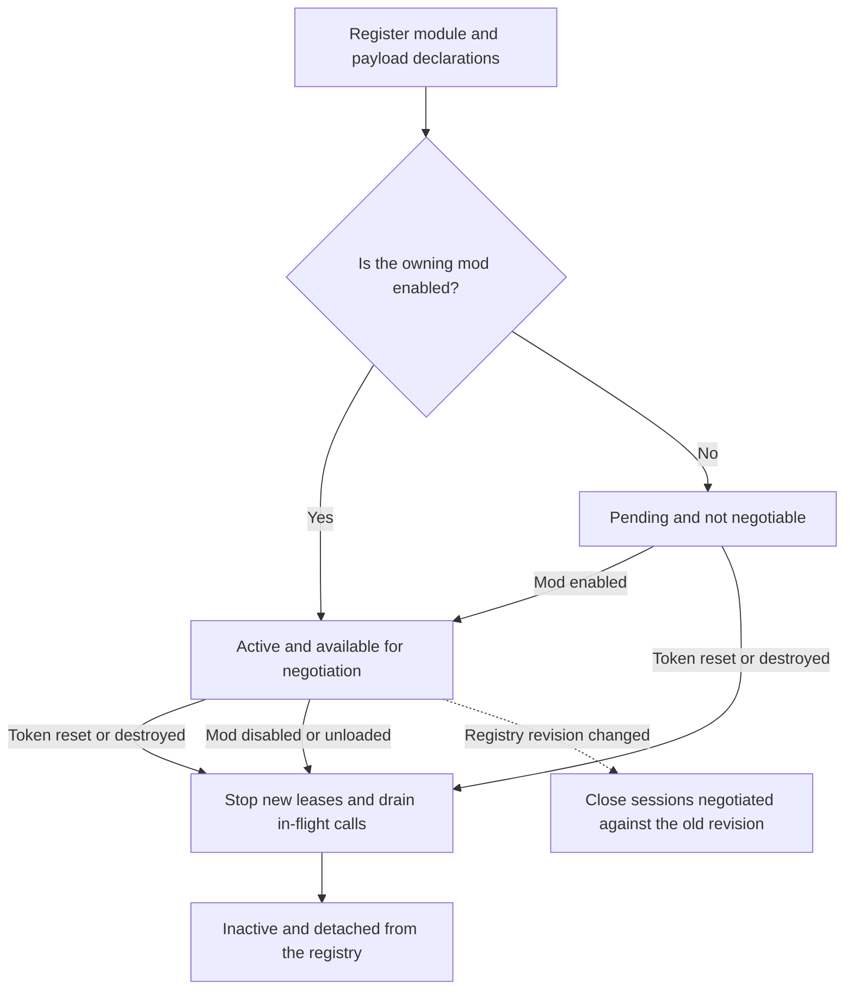
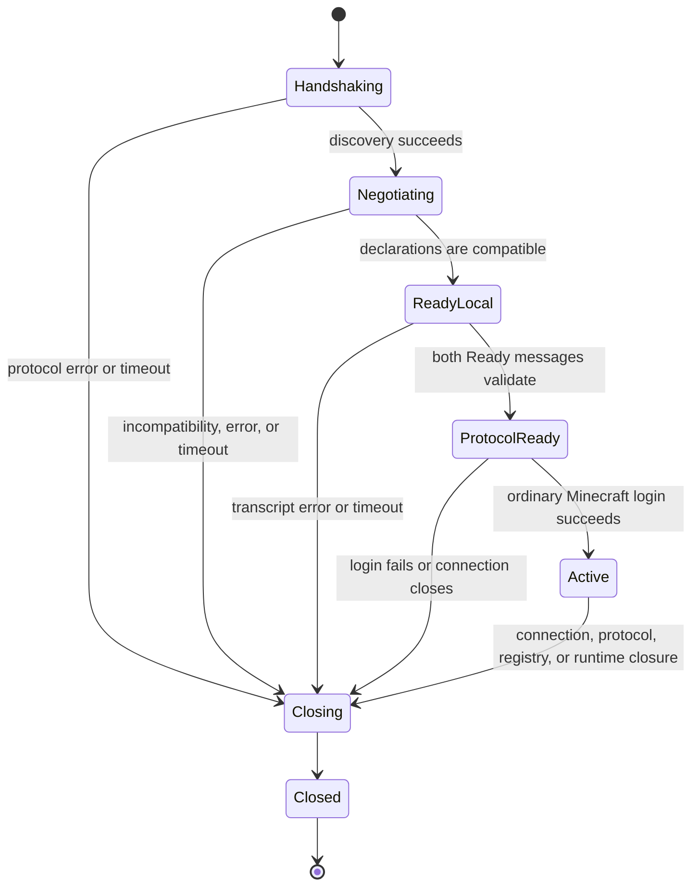
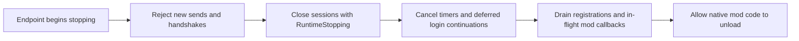
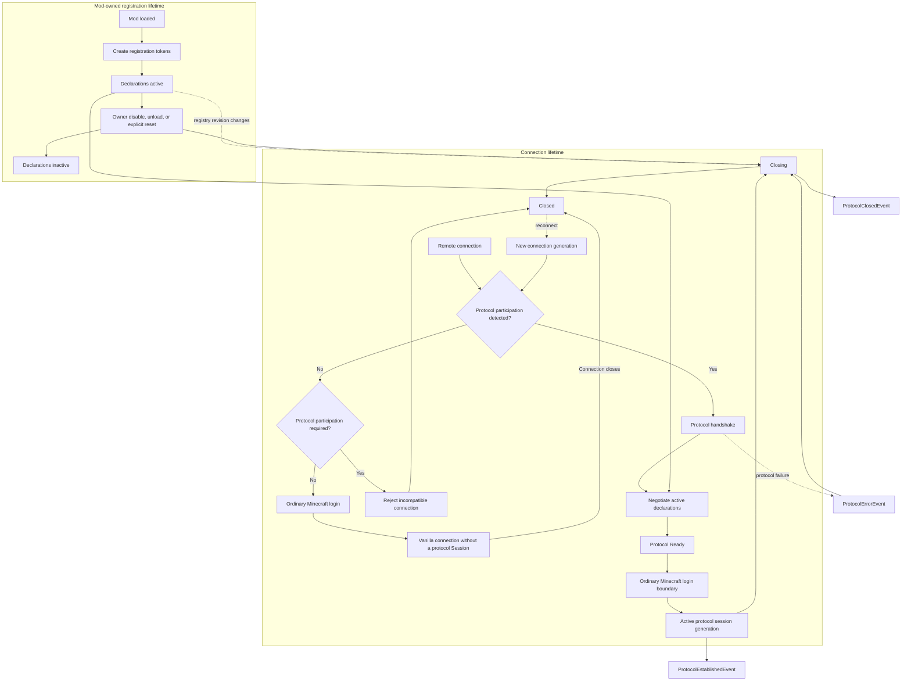

# Protocol Lifecycle

Protocol resources follow two related lifetimes: registrations belong to a mod, while sessions belong to one remote connection generation. Code must not extend either lifetime by retaining raw callback or Minecraft objects.

## Registration lifetime

`ModuleRegistration` and `PayloadRegistration` are move-only owner tokens. A successful token keeps its declaration registered until the token is reset, destroyed, or drained with its owning mod.

Store payload tokens and destroy them before the module token. `ModuleRegistration::reset()` fails with `RegistrationErrc::PayloadsStillRegistered` while any payload remains attached. Reset is idempotent for an already inactive token, but its `Expected` result must still be checked.

Registration created while the owner is disabled is pending rather than negotiable. On enable it becomes active. On disable or unload, LeviLamina first prevents new callback leases, then drains in-flight codec and handler calls, and only then permits owner code or its native library to become unavailable. A handler must not initiate synchronous self-unload; lifecycle code reports `LifecycleErrc::WouldDeadlock` when waiting would deadlock the active lease.

Detached work created by a handler is mod-owned and is not covered by this drain. Cancel or join that work before unloading the mod.



Reset payload tokens before their module token. The automatic owner drain makes disable and unload safe even when a mod still holds tokens, but it does not turn those token objects back into reusable registrations. A later enable must register a new protocol surface.

## Session states

A protocol-capable connection progresses through internal handshake states before it becomes available to mods:



Public sends require `Active`. A session is not exposed merely because discovery found LeviLamina on both endpoints. Required declarations, transcript validation, both protocol Ready messages, and the ordinary Minecraft login boundary must succeed first.

The diagram above applies only after the peer is identified as a protocol participant. A vanilla peer, including an LL installation with the protocol disabled, follows the ordinary Minecraft login path when endpoint policy permits it and never creates a protocol `Session`. If protocol participation is required, the connection is rejected instead of falling back.

## Observe lifecycle events

The common event bus publishes three protocol events:

- `ProtocolEstablishedEvent` carries the newly active `Session`;
- `ProtocolClosedEvent` carries the final `SessionView` and a `ProtocolCloseReason`;
- `ProtocolErrorEvent` carries a `ProtocolErrc` and, when available, the associated view.

```cpp
#include "ll/api/event/EventBus.h"
#include "ll/api/protocol/ProtocolEvents.h"

auto& bus = ll::event::EventBus::getInstance();

auto established = bus.emplaceListener<ll::protocol::ProtocolEstablishedEvent>(
    [](ll::protocol::ProtocolEstablishedEvent& event) {
        auto view = event.session().view();
        // Record capability state or initialize per-session mod state.
    }
);

auto closed = bus.emplaceListener<ll::protocol::ProtocolClosedEvent>(
    [](ll::protocol::ProtocolClosedEvent& event) {
        auto peer = event.session().peer();
        // Cancel mod work for this exact connection generation.
    }
);
```

Retain and remove listener tokens according to the normal EventBus ownership rules.

Close reasons are:

| Reason | Meaning |
| --- | --- |
| `ConnectionClosed` | Minecraft connection closure or kick. |
| `ProtocolError` | A protocol validation or state failure. |
| `Timeout` | Negotiation did not complete within its deadline. |
| `RegistryChanged` | The negotiated registry contract became stale. |
| `RuntimeStopping` | The protocol endpoint or process is stopping. |

Native networking can report the same physical close through multiple callbacks. LeviLamina normalizes lifecycle cleanup so one generation closes once. Mod cleanup should nevertheless be naturally idempotent.

## Reconnects create new generations

A reconnect is never a continuation of the old `Session`. It receives a new connection generation even when the player, address, or Minecraft connection key appears similar. Old handles return `Closed` or `WrongGeneration`; old timers and queued mod work must not mutate the replacement generation.

Index per-session mod state by the complete peer identity needed by the feature, including the supplied `subClientId` and connection generation. Do not normalize every subclient to the primary client.

## Registry changes close sessions

Version 1 has no dynamic renegotiation. Publishing, revoking, or replacing a relevant registration changes the registry revision and closes sessions negotiated against the old contract with `RegistryChanged`. A new connection negotiates the current declarations.

This fail-closed behavior prevents a payload codec or handler generation from changing underneath an active session. Mods should register their complete surface during setup, rather than repeatedly changing it during gameplay.

## Shutdown ordering

During endpoint shutdown, new sends fail, sessions close with `RuntimeStopping`, timers and deferred login work are cancelled, and registrations are drained before native code unload. Do not send from a close listener as a final notification: the session is already closing. Send any planned protocol shutdown payload while the endpoint remains active, and treat delivery as best effort.



## Complete lifecycle

The complete relationship between mod-owned registrations and connection-owned sessions is summarized below. The two lifetimes meet during negotiation, but neither owns the other.



See [Registering Protocol Modules and Payloads](registering_payload.md) for token setup and [Sending Protocol Payloads](sending_payload.md) for revocable-handle error handling.
