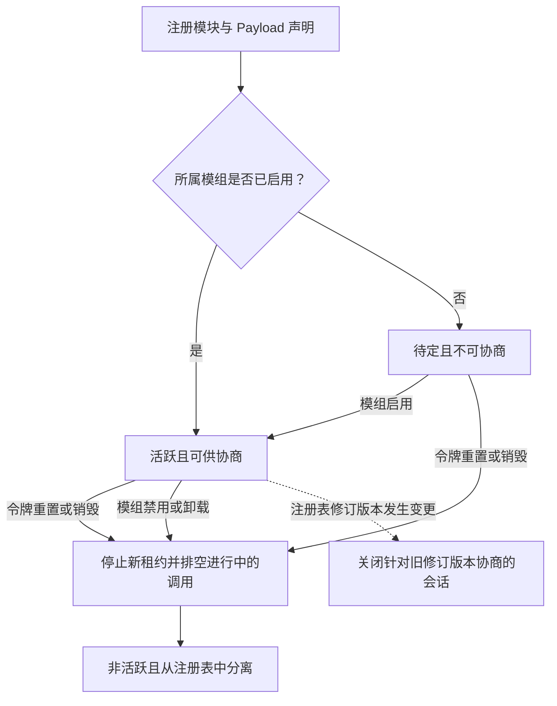
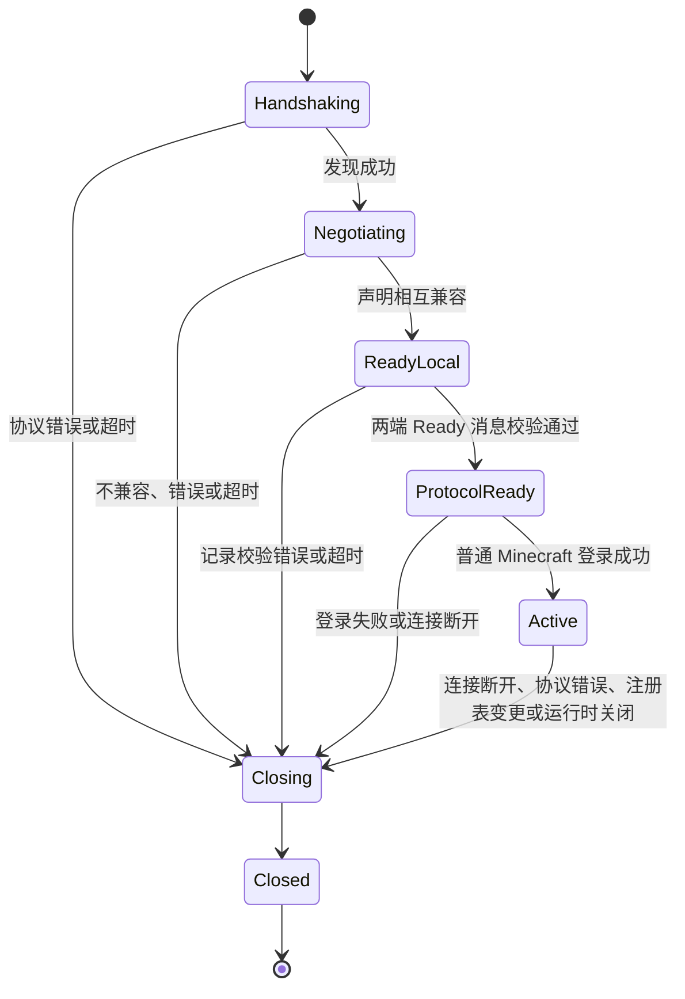
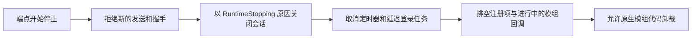
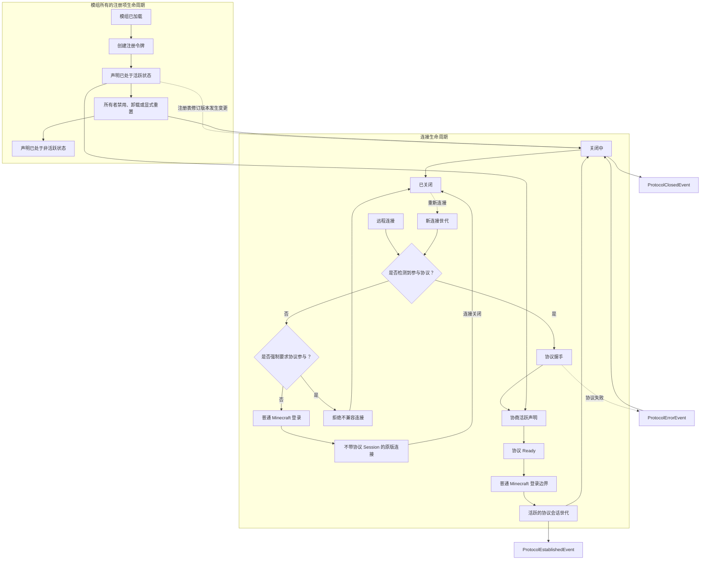

# 协议生命周期

协议资源遵循两个相关联的生命周期：注册项（Registration）隶属于模组，而会话（Session）隶属于单个远程连接世代（Generation）。代码绝不能通过保留原生回调或 Minecraft 裸对象来延长任一生命周期。

## 注册生命周期

`ModuleRegistration` 和 `PayloadRegistration` 是仅支持移动的所有者令牌。只要令牌未被重置、销毁，或随所属模组一同排空，有效的令牌就会保持其声明处于注册状态。

保存 Payload 令牌并在模块令牌之前销毁它们。在仍有任何 Payload 处于关联状态时，`ModuleRegistration::reset()` 将失败并返回 `RegistrationErrc::PayloadsStillRegistered`。对于已处于非活跃状态的令牌，重置操作是幂等的，但仍必须检查其 `Expected` 结果。

在所属模组处于禁用状态时创建的注册项处于待定（Pending）状态，无法参与协商。在模组启用后，它将转为活跃（Active）状态。在模组禁用或卸载时，LeviLamina 会首先阻止颁发新的回调租约，然后排空进行中的编解码器与处理器调用，在此之后才允许所有者代码或其原生库变为不可用状态。处理器绝不能发起同步自我卸载；当等待操作会导致活跃租约死锁时，生命周期代码将汇报 `LifecycleErrc::WouldDeadlock`。

由处理器创建的游离任务（Detached Work）属于模组自身所有，不受此排空机制的保护。在卸载模组前，必须取消或等待（Join）这些任务完成。



必须在模块令牌之前重置其所属的 Payload 令牌。所有者自动排空机制使得在模组仍持有令牌时也能安全执行禁用与卸载，但这并不会将这些令牌对象重新变为可用的注册状态。后续重新启用时必须注册全新的协议表面。

## 会话状态

支持协议的连接在向模组开放之前，会在内部经历一系列握手状态：



公开的发送操作要求处于 `Active` 状态。仅仅因为服务发现检测到两端都安装了 LeviLamina，会话并不会立即暴露。必须先相继通过强制声明检查、记录（Transcript）验证、两端的协议 Ready 消息校验，并越过普通 Minecraft 登录边界。

上图仅适用于对端已被识别为协议参与方的情况。对于原版对端（包括禁用了协议的 LeviLamina 实例），在端点策略允许时会遵循普通的 Minecraft 登录路径，绝不会创建协议 `Session`。如果端点策略强制要求协议参与，则会直接拒绝连接，而不是回退为原版连接。

## 监听生命周期事件

通用事件总线发布了三个协议事件：

- `ProtocolEstablishedEvent`：携带新变为活跃状态的 `Session`；
- `ProtocolClosedEvent`：携带最终的 `SessionView` 和 `ProtocolCloseReason`；
- `ProtocolErrorEvent`：携带 `ProtocolErrc` 以及相关视图（若可用）。

```cpp
#include "ll/api/event/EventBus.h"
#include "ll/api/protocol/ProtocolEvents.h"

auto& bus = ll::event::EventBus::getInstance();

auto established = bus.emplaceListener<ll::protocol::ProtocolEstablishedEvent>(
    [](ll::protocol::ProtocolEstablishedEvent& event) {
        auto view = event.session().view();
        // 记录能力状态或初始化单个会话的模组状态。
    }
);

auto closed = bus.emplaceListener<ll::protocol::ProtocolClosedEvent>(
    [](ll::protocol::ProtocolClosedEvent& event) {
        auto peer = event.session().peer();
        // 取消针对该特定连接世代的模组任务。
    }
);
```

请根据常规 EventBus 的所有权规则保留并移除监听器令牌。

关闭原因包括：

| 原因 | 含义 |
| --- | --- |
| `ConnectionClosed` | Minecraft 连接关闭或被踢出。 |
| `ProtocolError` | 协议校验或状态机错误。 |
| `Timeout` | 协商未在截止时间内完成。 |
| `RegistryChanged` | 协商时的注册表契约已过时。 |
| `RuntimeStopping` | 协议端点或进程正在停止。 |

原生网络层可能会通过多个回调汇报同一次物理关闭。LeviLamina 规范化了生命周期清理逻辑，确保每个世代只关闭一次。尽管如此，模组自身的清理逻辑仍应保持幂等性。

## 重新连接创建新世代

重新连接绝不是旧 `Session` 的延续。即使玩家、IP 地址或 Minecraft 连接键看起来相同，它也会被分配一个全新的连接世代。旧句柄将返回 `Closed` 或 `WrongGeneration`；旧的定时器与排队的模组工作绝不得修改替代它的新世代。

请根据功能需求，使用完整的对端身份（包括传入的 `subClientId` 与连接世代）为每个会话的模组状态建立索引。切勿将所有子客户端粗暴归一化为主客户端。

## 注册表变更关闭会话

版本 1 不支持动态重新协商。发布、注销或替换相关注册项会改变注册表的修订版本，并通过 `RegistryChanged` 关闭所有基于旧契约协商的会话。新连接将基于当前的最新声明进行协商。

这种“故障即关闭”（Fail-closed）的行为可防止 Payload 编解码器或处理器世代在活跃会话之下被动态篡改。模组应在初始化阶段注册完整的协议表面，避免在游戏运行期间频繁修改。

## 关闭顺序

在端点关闭期间，新的发送将失败，现有会话以 `RuntimeStopping` 原因关闭，定时器和延迟登录任务被取消，且所有注册项在原生代码卸载之前被排空。切勿在关闭事件监听器中发送最后通知 Payload：此时会话已处于关闭过程中。若计划发送协议下线 Payload，请在端点仍处于活跃状态时发送，并将其视为尽力交付（Best-effort）。



## 完整生命周期

模组所有的注册项生命周期与连接所有的会话生命周期之间的完整关系如下图所示。这两个生命周期在协商阶段相交，但彼此互不拥有。



令牌配置方法请参阅[注册协议模块与 Payload](registering_payload.zh.md)，可撤销句柄的错误处理请参阅[发送协议 Payload](sending_payload.zh.md)。
