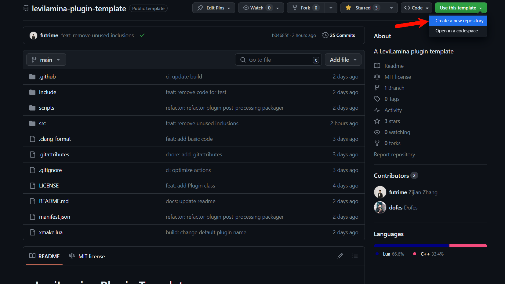
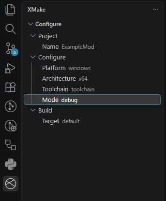
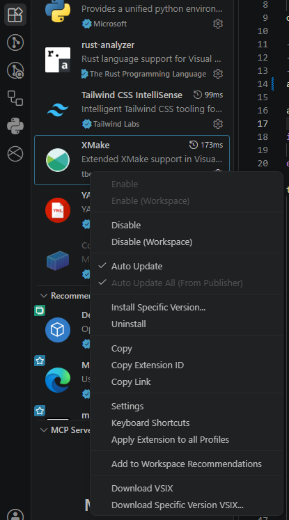
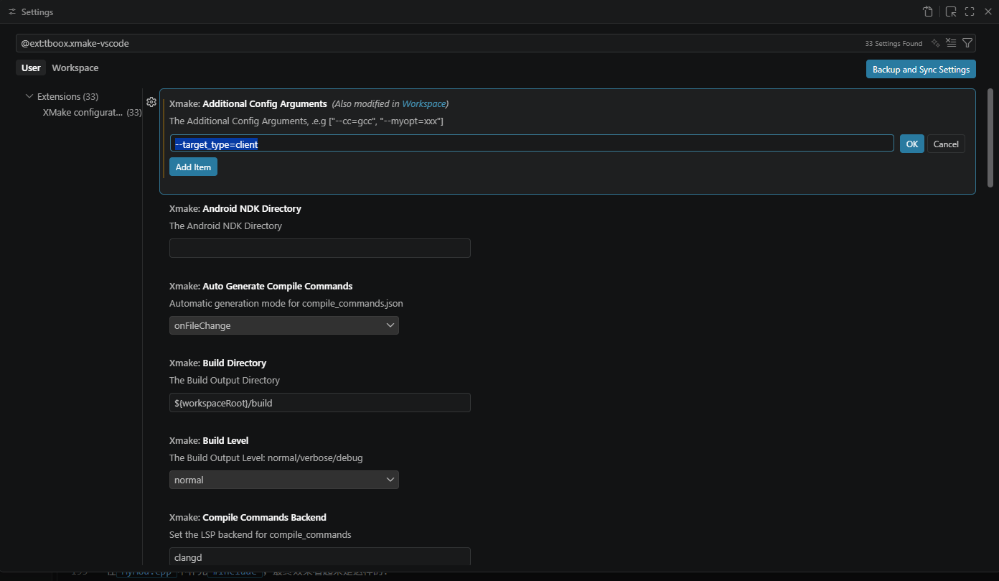

# 创建你的第一个模组

## 简介

这个教程旨在帮助你开始在LeviLamina中进行模组开发。它绝不是LeviLamina中所有可能性的完整教程，而是基础知识的总体概述。首先确保您了解C++，在 IDE中设置工作区，然后介绍大多数LeviLamina模组的基本知识。

在这个教程中，我们将会创建一个简单的模组，用于实现以下功能：

- 玩家可以输入`/suicide`指令自杀
- 玩家首次进入世界时给予一个钟
- 玩家使用钟时，弹出确认窗口询问是否自杀，如果确认则自杀

这个教程包含以下知识点：

- 日志输出
- 订阅事件
- 注册指令
- 读取配置文件
- 数据库存取
- 使用表单
- 构造Minecraft对象
- 调用Minecraft函数

!!! info
    本教程的所有源码可以在[ShrBox/ExampleMod](https://github.com/ShrBox/ExampleMod)找到。我们建议你一边看源码一边看教程。


## 学习C++

这些教程需要C++编程语言的基础知识。如果您刚刚开始使用C++或需要复习一下，以下是一个非详尽的列表。

- [C++ Developer Roadmap](https://roadmap.sh/cpp)
- [cppreference.com](https://en.cppreference.com/w/)
- [C++ Tutorial](https://www.w3schools.com/cpp/)
- [C++ Language Tutorial](https://cplusplus.com/doc/tutorial/)
- [hacking C++](https://hackingcpp.com/)
- [C++ Core Guidelines](http://isocpp.github.io/CppCoreGuidelines/CppCoreGuidelines)

## 设置工作区

在开发模组（或学习C++）之前，您需要设置一个开发环境。这包括但不限于以下内容：

- [xmake](https://xmake.io)
- [Visual Studio Code](https://code.visualstudio.com)
- [Git](https://git-scm.com)
- [Visual Studio](https://visualstudio.microsoft.com/)（安装Visual Studio时，请确保勾选了“使用C++的桌面开发”这一项）
- LLVM：打开Visual Studio Installer，在“使用 C++ 的桌面开发”可选组件下选择“适用于 Windows 的 C++ Clang 工具”。或者从[GitHub](https://github.com/llvm/llvm-project/releases/latest)下载。

### 为Visual Studio Code安装扩展程序

在安装完VSCode后，你还需要在VSCode中安装以下扩展：

- [C/C++](https://marketplace.visualstudio.com/items?itemName=ms-vscode.cpptools)
- [XMake](https://marketplace.visualstudio.com/items?itemName=tboox.xmake-vscode)
- [clangd](https://marketplace.visualstudio.com/items?itemName=llvm-vs-code-extensions.vscode-clangd)

## 创建模组仓库

访问[levilamina-mod-template](https://github.com/LiteLDev/levilamina-mod-template)，点击`Use this template`以使用这个模板初始化你的模组仓库。  
  
在某个用于存放模组工程的文件夹中使用`git clone`将模组仓库克隆到本地，然后使用VSCode打开。你需要修改其中的一些文件，填写你的模组信息。

首先，你需要修改`xmake.lua`中模组名字信息。修改模组名字是为了指定你的模组的名字，这个名字将会在LeviLamina中显示。名字允许英文大小写、数字、中划线，不允许包括空格和其他特殊字符，建议采用`example-mod`或`ExampleMod`这两种形式。在这里，我们的模组命名为`ExampleMod`。

```lua
target("ExampleMod") -- Change this to your mod name.
```

然后，最好手动固定一下Mod使用的LeviLamina版本，比如，我们需要使用LeviLamina 26.20的最新版本，我们在levilamina后面添加`26.20.*`作为版本号。也支持使用某个commit作为版本号，这在LeviLamina未能发布新版本时提前为模组适配新版本时很有用。

```lua
-- add_requires("levilamina x.x.x") for a specific version
-- add_requires("levilamina develop") to use develop version
-- please note that you should add bdslibrary yourself if using dev version
add_requires("levilamina 26.20.*", {configs = {target_type = get_config("target_type")}})
```

接着，修改`tooth.json`的内容。`tooth.json`为lip安装模组包提供了相关信息，正确配置后，你的模组将会被[Bedrinth](https://pkg.levimc.org)和[LeviLauncher](https://github.com/LiteLDev/LeviLauncher)收录，并能被全世界的用户下载安装。  
!!! tip
    其中`label`为空的`variant`代表服务端，`label`为`client`的variant代表客户端，如果您的模组只在服务端/客户端可用，可以将无用的variant删掉。在lip中可以用以下命令来安装：
    ```shell
    # 服务端
    lip install https://github.com/ShrBox/ExampleMod
    # 客户端
    lip install https://github.com/ShrBox/ExampleMod#client
    ```
- 将`tooth`字段的值改为这个模组的GitHub仓库地址，填写`info`中各个信息字段  
  `info.avatar_url`会显示在Bedrinth以及LeviLauncher的模组页面中，为模组挑选一个适合的图标也是展示您的模组的重要一环，这里为了方便直接使用教程编写者的GitHub头像  
- 修改各个`variant`中的`dependencies`里的LeviLamina目标版本为模组实际使用的LeviLamina版本  
- 然后根据仓库release地址填写`asset_url`字段，修改依赖的LeviLamina版本，并根据在`xmake.lua`中填写的模组名修改`place`的`src`和`dest`。对于本文的模组，以下是一个可行的参考：

```json
{
  "format_version": 3,
  "format_uuid": "289f771f-2c9a-4d73-9f3f-8492495a924d",
  "tooth": "https://github.com/ShrBox/ExampleMod",
  "version": "0.1.0",
  "info": {
    "name": "ExampleMod",
    "description": "Mod example for LeviLamina",
    "tags": [
      "platform:levilamina",
      "type:mod"
    ],
    "avatar_url": "https://avatars.githubusercontent.com/u/53301243"
  },
  "variants": [
    {
      "label": "",
      "platform": "win-x64",
      "dependencies": {
        "github.com/LiteLDev/LeviLamina": "26.20.*"
      },
      "assets": [
        {
          "type": "zip",
          "urls": [
            "https://{{tooth}}/releases/download/v{{version}}/ExampleMod-server-windows-x64.zip"
          ],
          "placements": [
            {
              "type": "dir",
              "src": "ExampleMod/",
              "dest": "plugins/ExampleMod/"
            }
          ]
        }
      ],
      "preserve_files": [],
      "remove_files": [],
      "scripts": {
        "pre_install": [],
        "install": [],
        "post_install": [],
        "pre_pack": [],
        "post_pack": [],
        "pre_uninstall": [],
        "uninstall": [],
        "post_uninstall": []
      }
    },
    {
      "label": "client",
      "platform": "win-x64",
      "dependencies": {
        "github.com/LiteLDev/LeviLamina#client": "26.20.*"
      },
      "assets": [
        {
          "type": "zip",
          "urls": [
            "https://{{tooth}}/releases/download/v{{version}}/ExampleMod-client-windows-x64.zip"
          ],
          "placements": [
            {
              "type": "dir",
              "src": "ExampleMod/",
              "dest": "mods/ExampleMod/"
            }
          ]
        }
      ],
      "preserve_files": [],
      "remove_files": [],
      "scripts": {
        "pre_install": [],
        "install": [],
        "post_install": [],
        "pre_pack": [],
        "post_pack": [],
        "pre_uninstall": [],
        "uninstall": [],
        "post_uninstall": []
      }
    }
  ]
}
```

然后，你需要修改`LICENSE`文件中的版权信息。你可以在[这里](https://choosealicense.com/licenses/)选择一个适合你的模组的开源协议。请放心，你的模组不需要开源，因为模组模板使用了CC0协议，你可以随意修改或删除`LICENSE`文件。但是，我们建议你使用一个开源协议，因为这样可以让其他人更容易地使用你的模组和帮助你改进你的模组。

接下来，你需要修改`README.md`文件中的内容。这个文件将会在你的模组仓库主页显示，你可以在这里介绍你的模组的功能、使用方法、配置文件、指令等等。

最后，你需要修改命名空间名。将`MyMod.cpp`和`MyMod.h`中命名空间`my_mod`以及类`MyMod`改成你想要的名字。按照C++常见惯例，命名空间名应当使用小写字母和下划线，且应当保持一致。这里，我们将命名空间统一改成`example_mod`，类名改为`ExmapleMod`。同样，你可以将`MyMod.cpp`和`MyMod.h`改为你想要的名字，但同时要记得把源文件中的`#include MyMod.h`改为新的头文件名。

## 构建你的模组

在一切开始之前，先让我们尝试构建一下空的模组。  
在VSCode界面左侧的侧边栏找到XMake图标，然后选择构建的模式，这里选择`Debug`  
  
然后我们还需要手动指定一下模组将被构建成服务端模组还是客户端模组

1. 点击VSCode左侧侧边栏的**扩展**按钮，在扩展标签页中找到**XMake**，然后右键点击**设置**  
     
2. 在弹出的设置页面中，找到`Additional Config Arguments`，点击下面的`Add Item`，在输入框中输入`--target_type=client`或`--target_type=server`，它们分别表示构建为客户端模组或服务端模组  
   

!!! failure
    如果你在更新仓库或配置构建过程中，出现了下载失败的情况，那么可能需要[配置GitHub镜像代理](https://xmake.io/zh/guide/package-management/network-optimization.html#mirror-proxy)
    或者[配置HTTP代理](https://xmake.io/zh/guide/package-management/network-optimization.html#proxy-setting)：

然后点击VSCode底栏的**Build the given target**图标来构建模组

## 注册指令`/suicide`

在Minecraft中，指令并不是一开始就能够注册的，而是需要在特定的程序执行之后才能注册。因此，你不能在模组加载时注册模组，在服务端中，你可以在模组启用时注册指令，因为此时服务端已完全启动，但在客户端中，你不能这么做，因为自26.10版本开始，客户端会在游戏启动完成时启用模组，而非在本地世界加载完成时。  
所以，在本教程中，我们将通过监听`ServerCommandRegisterEvent`来注册指令。

!!! warning
    模组在加载时，会调用其加载方法。但请不要将事件订阅、指令注册等任何与游戏相关的操作放在加载方法中，因为这些操作需要在游戏加载完成后才能进行。如果你在加载方法中进行了这些操作，那么你的模组将很有可能会在加载时崩溃。

!!! tip
    一般来说，模组的构造函数中只需要进行一些与游戏无关初始化操作即可，例如初始化日志系统、初始化配置文件、初始化数据库等等。

1. include一些我们需要的头文件  
   如前文所说，我们需要在`ServerCommandRegisterEvent`中注册指令，所以我们需要include下面的头文件
   ```cpp
   #include "ll/api/command/CommandHandle.h"
   #include "ll/api/command/CommandRegistrar.h"
   #include "ll/api/event/EventBus.h"
   #include "ll/api/event/command/ServerCommandRegisterEvent.h"
   ```

2. 在`ExampleMod::enable()`中实现我们的事件监听以及指令注册
   ```cpp
   bool ExampleMod::enable() { // 会被LeviLamina启用所有模组时调用
       auto& logger = getSelf().getLogger();
       logger.debug("Enabling..."); // 向控制台以DEBUG等级输出日志
       using namespace ll::
           event; // 提前使用命名空间以精简代码，比如ll::event::EventBus可以直接写成EventBus，ll::event::command::ServerCommandRegisterEvent可以直接写成   command::ServerCommandRegisterEvent
   
       auto& bus = EventBus::getInstance(); // EventBus是单例，通过getInstance()方法获取实例
   
       bus.emplaceListener<
           command::ServerCommandRegisterEvent>([&logger](
                                                    command::ServerCommandRegisterEvent&
                                                ) { // 以lambda表达式注册事件监听器，参数为ServerCommandRegisterEvent的引用
           auto& command =
               ll::command::CommandRegistrar::getInstance(
                   false
               ) // CommandRegistrar是单例，通过getInstance()方法获取实例，参数表示是否为客户端侧指令，传入false表示为服务端
                   .getOrCreateCommand(
                       "suicide",
                       "Commits suicide.",
                       CommandPermissionLevel::Any
                   ); // 获取或创建指令，第一个参数为指令名称，第二个参数为指令描述，会出现在客户端的指令提示以及服务端的help中，第三个参数为最低指令权限等级
   
           command.overload().execute([&logger](
                                          CommandOrigin const& origin,
                                          CommandOutput&       output
                                      ) { // 重载指令并且注册指令回调
   
               auto* entity = origin.getEntity(); // 通过CommandOrigin获取执行指令的实体对象

               if (entity == nullptr
                   || !entity->isPlayer()) { // 如果实体对象为空指针或实体对象并非玩家
   
                   output.error(
                       "Only players can commit suicide"
                   ); // 通过CommandOutput向控制台/命令方块等非玩家对象输出错误
   
                   return;
               }
   
               auto* player = static_cast<Player*>(
                   entity
               ); // 将实体对象转为玩家对象，因为在Minecraft中玩家对象继承自实体对象，且在上文我们已经判断过实体为玩家了
   
               player->kill(); // 调用kill()方法杀死玩家
   
               logger.info(
                   "{} killed themselves",
                   player->getRealName()
               ); // 向控制台输出玩家自杀了
           });
       });
       return true; // 返回true表明模组启用成功
   }
   ```

我们结合以上代码中的注释将以上的代码拆开来理解
LeviLamina的指令系统支持使用`CommandRegistrar::getOrCreateCommand()`函数直接注册或获取指令。

```cpp
auto& command = ll::command::CommandRegistrar::getInstance()
                        .getOrCreateCommand("suicide", "Commits suicide.", CommandPermissionLevel::Any);
```

第三个参数为执行指令至少需要的权限等级，如果我们希望普通玩家也能执行，应当选择`Any`。而`GameDirectors`对应权限至少为Operator（通过控制台OP指令赋予权限或通过暂停菜单提升为操作员）的玩家，`Host`对应控制台的权限。  
然后，我们需要为指令增加一个重载并设置对应的回调。

```cpp
command.overload().execute([this](CommandOrigin const& origin, CommandOutput& output) {
    // ...
});
```

!!! note
    指令的重载意味着指令的一个模式，例如`ll <unload|reload|reactivate> <mod:string>` 是一个重载，而`ll list`是另一个重载。  
    下面是一个例子，来自LeviLamina的模组管理指令：

```cpp
enum LeviCommandOperation : int {
    unload,
    reload,
    reactivate,
};
struct LeviCommand {
    LeviCommandOperation operation;
    SoftEnum<mod::ModNames>   mod;
};

void registerModManageCommand() {
    // ...
    cmd.alias("ll");
    cmd.overload<LeviCommand3>().text("load").required("mod").execute(
        [](CommandOrigin const&, CommandOutput& output, LeviCommand3 const& param) {
            // ...
        }
    ); // ll load <mod:string>
    cmd.overload<LeviCommand>()
        .required("operation")
        .required("mod")
        .execute([](CommandOrigin const&, CommandOutput& output, LeviCommand const& param) {
            // ...
        }); // ll <unload|reload|reactivate> <mod:string>
    cmd.overload().text("list").execute([](CommandOrigin const&, CommandOutput& output) {
        // ...
    }); // ll list
}
```

!!! warning
    由于MCBE缺乏RTTI信息，因此不能够使用`dynamic_cast<T>()`。

!!! tip
    你可能注意到另一个函数`player->getName()`，但我们并没有使用它。这是因为玩家的名字是可以通过模组或其它方式进行修改的，而`player->getRealName()`的结果则是固定的。

到这一步，指令对象已经配置完毕，当服务器启动后或客户端进入本地世界后，指令对象将被加载到游戏中。  
如果在`enable()`函数中返回了`false`，则LeviLamina会认为模组启用失败，并在控制台上提示错误信息。

## 读取配置文件

我们的模组的第二个功能是玩家首次进入服务器时，给予一个钟；第三个功能是使用钟的时候，弹出确认自杀的提示，玩家确认后可以自杀。但这两个功能有个小问题：服务器管理员可能已经安装了其它的模组，实现了类似的功能，而不希望使用这个自杀模组中这几个功能。我们希望能提供某种方式，允许管理员开关这两个功能。

我们在此非常高兴地宣布，LeviLamina在C++中，实现了配置文件与配置信息结构体的反射。这意味着，我们可以在C++中定义一个结构体，然后在配置文件中定义这个结构体的实例，LeviLamina会自动将配置文件中的内容读取到结构体实例中。这样，我们就可以在C++中直接使用这个结构体实例，而不需要自己去解析配置文件。

首先，我们另外创建一个`Config.h`文件，定义一个结构体`Config`，用于保存配置信息。

```cpp
namespace example_mod {
struct Config {
    int  version                = 1;
    bool doGiveClockOnFirstJoin = true;
    bool enableClockMenu        = true;
};
} // namespace example_mod

```

我们在匿名命名空间中增加一个成员变量，用于保存配置文件中的配置信息。

```cpp
namespace {
Config config;
}
```

然后，我们读取配置文件并将配置信息保存到成员变量中。

```cpp
bool ExampleMod::load() { // 会被LeviLamina加载所有模组
    auto& logger = getSelf().getLogger();
    logger.debug("Loading...");
    // 加载或初始化配置文件
    const auto& configFilePath = getSelf().getConfigDir() / "config.json";
    if (!ll::config::loadConfig(config, configFilePath)) {
        logger.warn("Cannot load configurations from {}", configFilePath);
        logger.info("Saving default configurations");

        if (!ll::config::saveConfig(config, configFilePath)) {
            logger.error("Cannot save default configurations to {}", configFilePath);
        }
    }
    return true;
}
```

在这段代码中，我们首先获取模组的配置文件路径，然后调用`ll::config::loadConfig()`函数，将配置文件中的配置信息读取到结构体实例中。如果读取失败，我们将会在控制台上输出警告信息，并将默认配置信息保存到配置文件中。

!!! note
    由于配置文件读取是在加载方法内进行的，所以在后续操作中可以保证配置文件已经读取成功了。

## 将玩家进服信息持久化保存在数据库中

我们的模组的第二个功能是玩家首次进入服务器时，给予一个钟。但是，如果我们将进服信息保存在内存中，那么当服务器重启后，玩家的进服信息就会丢失。因此，我们需要将玩家的进服信息持久化保存在数据库中。LeviLamina提供了KV数据库的封装，可以让我们在C++中直接使用数据库。

首先，我们在匿名命名空间中增加一个成员变量，用于保存数据库实例。

```cpp
namespace {
Config                                config;
std::unique_ptr<ll::data::KeyValueDB> playerDb;
} // namespace
```

!!! note
    为什么是`std::unique_ptr<ll::KeyValueDB>`而不是`ll::KeyValueDB`？这是因为`ll::KeyValueDB`禁止拷贝，只能移动。因此，我们需要使用`std::unique_ptr`来保存`ll::KeyValueDB`的实例。

!!! warning
    请不要使用普通的指针来保存`ll::KeyValueDB`的实例，因为这样很容易使得生命周期管理变得复杂，从而导致内存泄漏和其他问题。请记住：你在写C++，而不是C。

然后，我们在`load`方法中，初始化数据库实例。

```cpp
bool ExampleMod::load() { // 会被LeviLamina加载所有模组
    // ...

    // 初始化数据库
    const auto& playerDbPath = getSelf().getDataDir() / "players";
    playerDb                 = std::make_unique<ll::data::KeyValueDB>(playerDbPath);

    return true;
}
```

在这段代码中，我们首先获取模组的数据库路径，然后调用`std::make_unique<ll::data::KeyValueDB>()`函数，创建一个数据库实例。如果数据库路径不存在，那么`std::make_unique<ll::data::KeyValueDB>()`函数会自动创建数据库路径。

!!! note
    由于数据库初始化是在构造函数内进行的，所以在后续操作中可以保证数据库已经初始化成功了。

## 玩家首次进入游戏时，给予一个钟

我们的模组的第二个功能是玩家首次进入服务器时，给予一个钟。我们需要在玩家进服时，判断玩家是否首次进服，如果是，则给予一个钟。  
在Minecraft中，玩家进入游戏时，会触发事件`PlayerJoinEvent`。在LeviLamina中，我们可以订阅这个事件，当这个事件被触发时，模组可以在这里实现玩家进服时的逻辑。  
LeviLamina足够智能，能够在模组被禁用时自动取消事件的监听，所以我们不需要为事件监听的生命周期担心。

```cpp
bool ExampleMod::enable() { // 会被LeviLamina启用所有模组时调用
    // ...

    bus.emplaceListener<ll::event::player::PlayerJoinEvent>([&doGiveClockOnFirstJoin = config.doGiveClockOnFirstJoin,
                                                             &logger,
                                                             &playerDb =
                                                                 playerDb](ll::event::player::PlayerJoinEvent& event) {
        if (doGiveClockOnFirstJoin) {    // 判断是否需要在玩家首次加入时给予钟
            auto& player = event.self(); // 获取玩家对象

            const auto& uuid = player.getUuid(); // 获取玩家的UUID

            // 检查玩家之前是否加入过
            if (!playerDb->get(uuid.asString())) {

                // 构造ItemStack对象
                ItemStack itemStack("minecraft::clock", 1, 0, nullptr);
                // 给玩家的背包添加ItemStack对象
                player.add(itemStack);

                // 需要刷新玩家的背包来让玩家看得见钟
                player.refreshInventory();

                // 标记玩家已加入过
                if (!playerDb->set(uuid.asString(), "true")) {
                    logger.error("Cannot mark {} as joined in database", player.getRealName());
                }

                // 以INFO等级向控制台输出日志，表示玩家首次加入并给予了钟
                logger.info("First join of {}! Giving them a clock", player.getRealName());
            }
        }
    });

    return true; // 返回true表明模组启用成功
}
```

让我们将这些代码拆开来看。在回调lambda函数中，我们捕获了配置中的`doGiveClockOnFirstJoin`，以及logger变量和数据库实例。然后，我们判断配置中的`doGiveClockOnFirstJoin`是否为`true`，如果是，则继续执行逻辑。  
接下来，我们获取事件实例中的玩家实例和玩家的UUID。

!!! note
    这里获取的UUID的类型是`mce::UUID`而不是`std::string`。我们建议只有在需要时才将UUID转换为`std::string`，因为`mce::UUID`的实现更加高效。

!!! danger
    请不要使用XUID作为玩家的唯一标识符。虽然在LiteLoaderBDS时代，不少模组使用XUID作为玩家的唯一标识符，但这是不正确的。XUID是Xbox Live的标识符，而不是玩家的标识符。如果服务器没有开启在线模式，或者存在假人，那么XUID的行为将是不可预测的。因此，我们强烈建议使用UUID作为玩家的唯一标识符。

然后，我们使用玩家的UUID作为键，从数据库中获取玩家是否已经进服过。如果玩家已经进服过，那么我们就不需要再给予玩家一个钟了。  
接下来，我们构造了一个钟的物品栈，并将这个物品栈添加到玩家的背包中。

!!! note
    这里使用了`ItemStack`类，而不是`Item`类。`ItemStack`类是`Item`类的一个包装，它包含了物品的数量、附魔、耐久等信息，而`Item`类仅仅代表这个物品类别。因此应当使用`ItemStack`类而不是`Item`类。

然后，我们需要刷新玩家的背包，以便玩家能够看到钟。  
最后，我们将玩家的UUID作为键，将玩家标记为已经进服过。

## 使用钟的时候，弹出确认自杀的提示

我们的模组的第三个功能是使用钟的时候，弹出确认自杀的提示，玩家确认后可以自杀。我们需要订阅玩家使用物品的事件，当玩家使用钟时，弹出确认自杀的提示。  
在`enable()`函数中注册这个事件监听器。

```cpp
bool ExampleMod::enable() { // 会被LeviLamina启用所有模组时调用
    auto& logger = getSelf().getLogger();

    // ...

    bus.emplaceListener<ll::event::PlayerUseItemEvent>([enableClockMenu = config.enableClockMenu,
                                                        &logger](ll::event::PlayerUseItemEvent& event) {
        if (enableClockMenu) {
            auto& player = event.self();    // 获取玩家对象
            auto& itemStack = event.item(); // 获取玩家使用的物品对象

            if (itemStack.getRawNameId() == "clock") { // 如果物品是钟
                using namespace ll::form;              // 使用ll::form命名空间以简化代码
                // 构造ModalForm对象，传入标题、内容、上方按钮文本、下方按钮文本
                ModalForm form("Warning", "Are you sure you want to kill yourself?", "Yes", "No");

                // 发送ModalForm给玩家，并注册回调函数
                form.sendTo(player, [&logger](Player& player, ModalFormResult res, FormCancelReason) {
                    // 如果玩家选择了上方按钮（Yes），则杀死玩家
                    if (res.has_value() && res.value() == ModalFormSelectedButton::Upper) {
                        player.kill();

                        logger.info("{} killed themselves", player.getRealName());
                    }
                });
            }
        }
    });

    return true; // 返回true表明模组启用成功
}
```

让我们将代码拆开来看。在回调lambda函数中，我们捕获了配置项`enableClockMenu`和logger，然后进行判断，只有配置项启用时，才执行逻辑。  
在逻辑中，我们首先获取该事件的两个属性，即使用物品的玩家和被使用的物品。然后判断物品id是否为`clock`，并执行弹出表单的逻辑。

!!! warning
    不要使用`itemStack.getName()`，因为这个函数返回的是物品显示的名字，比如`Clock`或`Iron Sword`。

在这里我们使用了最简单的模态表单`ModalForm`，其构造函数的参数分别是：
1. 表单的标题
2. 表单提示内容
3. 左下角按钮内容
4. 右下角按钮内容。

回调函数接收三个参数，分别是：
1. 表单发送向的玩家
2. 玩家的选择结果
3. 表单被取消的原因，此处暂未使用。

## 运行你的模组

如果你的模组正常构建完毕，你应该能看到`bin/`目录内有一个以你的模组名为名的目录。将这个目录拷贝到LeviLamina服务端目录中的`plugins/`目录或LeviLamina客户端目录中的`mods`目录中（如果没有，请创建）。  
然后运行LeviLamina服务端（`bedrock_server_mod.exe`）或LeviLamina客户端即可。

## 发布你的模组

1. 将`tooth.json`中的`version`字段改为你即将发布的版本，例如`0.1.0`  
2. 为`CHANGELOG.md`添加即将发布的新版本的CHANGELOG，具体的CHANGELOG格式可以参照[keepachangelog.com](https://keepachangelog.com/zh-CN/1.1.0/)，例如：
   ```md
   ## 0.1.0 - 2026-08-04
   
   ### Added
   
   - First release.
   
   ```
3. （可选）安装Node.js，然后运行
    ```shell
    npm install keep-a-changelog -g
    ```
4. （可选）运行
    ```shell
    changelog --format markdownlint
    ```
    来格式化`CHANGELOG.md`
6. 在GitHub上创建新的release，例如`v0.1.0`

GitHub Actions会自动将CHANGELOG.md的内容写进release，稍等几分钟，你的模组将会自动被编译并上传到release

!!! warning
    一定要使用以v开头并且符合[语义化版本](https://semver.org/lang/zh-CN/)的版本号，否则无法正常被Bedrinth和LeviLauncher收录！
