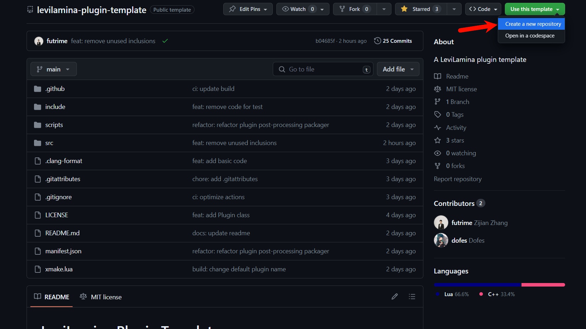

# 创建你的第一个插件

## 简介

这个教程旨在帮助你开始在LeviLamina中进行插件开发。它绝不是LeviLamina中所有可能性的完整教程，而是基础知识的总体概述。首先确保您了解C++，在 IDE中设置工作区，然后介绍大多数LeviLamina插件的基本知识。

在这个教程中，我们将会创建一个简单的插件，用于实现以下功能：

- 玩家可以输入`/suicide`指令自杀
- 玩家首次登录服务器时给予一个钟
- 玩家使用钟时，弹出确认窗口询问是否自杀，如果确认则自杀

这个教程包含以下知识点：

- 日志输出
- 订阅和退订事件
- 注册指令
- 读取配置文件
- 数据库存取
- 使用表单
- 构造Minecraft对象
- 调用Minecraft函数

!!! info
    本教程的所有源码可以在[futrime/better-suicide](https://github.com/futrime/better-suicide)找到。我们建议你一边看源码一边看教程。如果你已经安装了[lip](https://docs.lippkg.com)，你还可以直接运行以下代码在LeviLamina实例环境中安装本教程中实现的插件。

    ```shell
    lip install github.com/futrime/better-suicide
    ```

## 学习C++

这些教程需要C++编程语言的基础知识。如果您刚刚开始使用C++或需要复习一下，以下是一个非详尽的列表。

- [C++ Developer Roadmap](https://roadmap.sh/cpp)
- [cppreference.com](https://en.cppreference.com/w/)
- [C++ Tutorial](https://www.w3schools.com/cpp/)
- [C++ Language Tutorial](https://cplusplus.com/doc/tutorial/)
- [hacking C++](https://hackingcpp.com/)
- [C++ Core Guidelines](http://isocpp.github.io/CppCoreGuidelines/CppCoreGuidelines)

## 设置工作区

在开发插件（或学习C++）之前，您需要设置一个开发环境。这包括但不限于以下内容：

- [xmake](https://xmake.io)
- [Visual Studio Code](https://code.visualstudio.com)
- [Git](https://git-scm.com)
- [Visual Studio 2022](https://visualstudio.microsoft.com/) （安装Visual Studio 2022时，请确保勾选了C++桌面应用开发这一项）

!!! warning
    如果你安装的不是最新版本的Visual Studio 2022、MSVC和Windows SDK，则后续在构建、加载、运行插件中有可能遇到问题。如果你遇到了类似`xxx is not a member of std`这样的问题，请考虑这个可能性。本教程测试构建的环境是Visual Studio Community 2022 17.8.1、MSVC v143 - VS 2022 C++ x64/x86 build tools (v14.38-17.8)、Windows 11 SDK (10.0.22000.0)

!!! tip
    由于LeviLamina项目极大，如果你使用Visual Studio Code，其自带的Intellisense系统可能不堪重负。我们建议你安装clangd插件并使用clangd进行代码检查等。安装clangd和对应的插件后，你需要运行以下命令生成`compile_commands.json`，然后重启VSCode以使clangd生效。

    ```shell
    xmake project -k compile_commands
    ```

然后，你需要在某处安装LeviLamina。本教程针对的是LeviLamina 0.6.3，对于其它版本，可能需要做一些修改。

## 创建插件仓库

访问[levilamina-plugin-template](https://github.com/LiteLDev/levilamina-plugin-template)，点击`Use this template`以使用这个模板初始化你的插件仓库。



将插件仓库使用Git克隆到本地，然后使用VSCode打开。你需要修改其中的一些文件，填写你的插件信息。

首先，你需要修改`xmake.lua`中插件名字信息。修改插件名字是为了指定你的插件的名字，这个名字将会在LeviLamina中显示。名字允许英文大小写、数字、中划线，不允许包括空格和其他特殊字符，建议采用`example-plugin`或`ExamplePlugin`这两种形式。在这里，我们的插件命名为`better-suicide`。

```lua
target("better-suicide") -- Change this to your plugin name.
```

接着，修改`tooth.json`的内容。`tooth.json`为lip安装插件包提供了相关信息，正确配置后，你的插件将会被[lip Index](https://lippkg.com)收录，并能被全世界的用户下载安装。将`tooth`字段的值改为这个插件的GitHub仓库地址，填写`info`中各个信息字段，然后根据仓库release地址填写`asset_url`字段，修改依赖的LeviLamina版本，并根据在`xmake.lua`中填写的插件名修改`place`的`src`和`dest`。对于本文的插件，以下是一个可行的参考：

```json
{
    "format_version": 2,
    "tooth": "github.com/futrime/better-suicide",
    "version": "0.6.0",
    "info": {
        "name": "better-suicide",
        "description": "Allow players to suicide in Minecraft.",
        "author": "futrime",
        "tags": [
            "levilamina",
            "plugin"
        ]
    },
    "asset_url": "https://github.com/futrime/better-suicide/releases/download/v0.6.0/better-suicide-windows-x64.zip",
    "prerequisites": {
        "github.com/LiteLDev/LeviLamina": "0.9.x"
    },
    "files": {
        "place": [
            {
                "src": "better-suicide/*",
                "dest": "plugins/better-suicide/"
            }
        ]
    }
}

```

然后，你需要修改`LICENSE`文件中的版权信息。你可以在[这里](https://choosealicense.com/licenses/)选择一个适合你的插件的开源协议。请放心，你的插件不需要开源，因为插件模板使用了CC0协议，你可以随意修改或删除`LICENSE`文件。但是，我们建议你使用一个开源协议，因为这样可以让其他人更容易地使用你的插件和帮助你改进你的插件。

接下来，你需要修改`README.md`文件中的内容。这个文件将会在你的插件仓库主页显示，你可以在这里介绍你的插件的功能、使用方法、配置文件、指令等等。

最后，你需要修改命名空间名。将`MyPlugin.cpp`和`MyPlugin.h`中命名空间`my_plugin`改成你想要的名字。按照C++常见惯例，命名空间名应当使用小写字母和下划线，且应当保持一致。这里，我们统一改成`better_suicide`。同样，你可以将`MyPlugin.cpp`和`MyPlugin.h`改为你想要的名字，但同时要记得把源文件中的`#include MyPlugin.h`改为新的头文件名。

## 构建你的插件

在一切开始之前，先让我们尝试构建一下空的插件。

先更新一下仓库：

```shell
xmake repo -u
```

配置构建：

```shell
xmake f -m debug
```

!!! tip
    如果你想以其它模式构建，也可以使用`-m release`或`-m releasedbg`。这两个模式会开启`fastest`优化等级。其中，`-m release`会关闭调试信息，而`-m releasedbg`会开启调试信息，就像`-m debug`一样。对于它们的具体区别，请参考[自定义规则 - xmake](https://xmake.io/#/zh-cn/manual/custom_rule)。

!!! failure
    如果你在更新仓库或配置构建过程中，出现了下载失败的情况，那么可能需要[配置GitHub镜像代理](https://xmake.io/#/zh-cn/package/remote_package?id=%e9%95%9c%e5%83%8f%e4%bb%a3%e7%90%86)：

    ```shell
    xmake g --proxy_pac=github_mirror.lua
    ```

    或者[配置HTTP代理](https://xmake.io/#/zh-cn/package/remote_package?id=%e8%ae%be%e7%bd%ae%e4%bb%a3%e7%90%86)：


然后构建：

```shell
xmake
```

!!! failure
    构建失败了？尝试升级一下Visual Studio 2022、MSVC和Windows SDK吧。记住，一定要升级到最新版本。

## 补充`#include`

在`MyPlugin.cpp`中补充`#include`，最终效果看起来是这样的：

```cpp
#include "MyPlugin.h"

#include "Config.h"

#include <fmt/format.h>
#include <functional>
#include <ll/api/Config.h>
#include <ll/api/command/Command.h>
#include <ll/api/command/CommandHandle.h>
#include <ll/api/command/CommandRegistrar.h>
#include <ll/api/data/KeyValueDB.h>
#include <ll/api/event/EventBus.h>
#include <ll/api/event/ListenerBase.h>
#include <ll/api/event/player/PlayerJoinEvent.h>
#include <ll/api/event/player/PlayerUseItemEvent.h>
#include <ll/api/form/ModalForm.h>
#include <ll/api/io/FileUtils.h>
#include <ll/api/plugin/NativePlugin.h>
#include <ll/api/plugin/PluginManagerRegistry.h>
#include <ll/api/service/Bedrock.h>
#include <mc/entity/utilities/ActorType.h>
#include <mc/server/commands/CommandOrigin.h>
#include <mc/server/commands/CommandOutput.h>
#include <mc/server/commands/CommandPermissionLevel.h>
#include <mc/world/actor/player/Player.h>
#include <mc/world/item/registry/ItemStack.h>
#include <memory>
#include <stdexcept>
```

## 注册指令`/suicide`

在BDS中，指令并不是一开始就能够注册的，而是需要在特定的程序执行之后才能注册。因此，你不能在插件加载时注册插件，而只能在插件启用时注册指令。一般来说，还应当在插件禁用时解注册指令，以防止出现未定义行为。

!!! warning
    插件在加载时，会调用其构造函数。但请不要将事件订阅、指令注册等任何与游戏相关的操作放在构造函数中，因为这些操作需要在游戏加载完成后才能进行。如果你在构造函数中进行了这些操作，那么你的插件将很有可能会在加载时崩溃。

!!! tip
    一般来说，插件的构造函数中只需要进行一些与游戏无关初始化操作即可，例如初始化日志系统、初始化配置文件、初始化数据库等等。

```cpp
auto enable(ll::plugin::NativePlugin& /*self*/) -> bool {

    // ...

    // Register commands.
    auto commandRegistry = ll::service::getCommandRegistry();
    if (!commandRegistry) {
        throw std::runtime_error("failed to get command registry");
    }

    auto& command = ll::command::CommandRegistrar::getInstance()
                        .getOrCreateCommand("suicide", "Commits suicide.", CommandPermissionLevel::Any);
    command.overload().execute<[](CommandOrigin const& origin, CommandOutput& output) {
        auto* entity = origin.getEntity();
        if (entity == nullptr || !entity->isType(ActorType::Player)) {
            output.error("Only players can commit suicide");
            return;
        }

        auto* player = static_cast<Player*>(entity); // NOLINT(cppcoreguidelines-pro-type-static-cast-downcast)
        player->kill();

        getInstance().getLogger().info("{} killed themselves", player->getRealName());
    }>();

    // ...

    return true;
}
```

让我们将这些代码拆开来看。下列语句获取指令注册表。指令注册表只有在特定时机之后才会生效，因此其类型为`optional_ref<T>`。我们需要判定获取到的指令注册表是否有效。

```cpp
auto commandRegistry = ll::service::getCommandRegistry();
if (!commandRegistry) {
    throw std::runtime_error("failed to get command registry");
}
```

LeviLamina的指令系统支持使用`CommandRegistrar::getOrCreateCommand()`函数直接注册或获取指令。

```cpp
auto& command = ll::command::CommandRegistrar::getInstance()
                        .getOrCreateCommand("suicide", "Commits suicide.", CommandPermissionLevel::Any);
```

其中，第一个参数是指令本身，即在控制台或聊天栏内输入的字符。虽然尚未测试各种特殊字符能否生效，但我们仍然建议只包含小写英文字母。第二个参数是指令简介，在聊天栏输入指令的一部分时，会在上方以半透明灰色的形式显示候选指令及其简介。第三个参数是指令的权限等级，其定义如下。其中，如果我们希望生存模式下的普通玩家也能执行，应当选择`Any`。而`GameDirectors`对应至少为创造模式的玩家的权限，`Admin`对应至少为OP的权限，`Host`对应控制台的权限。

```cpp
enum class CommandPermissionLevel : schar {
    Any           = 0x0,
    GameDirectors = 0x1,
    Admin         = 0x2,
    Host          = 0x3,
    Owner         = 0x4,
    Internal      = 0x5,
};
```

然后，我们需要为指令增加一个重载并设置对应的回调。

```cpp
command.overload().execute<[](CommandOrigin const& origin, CommandOutput& output) {
    // ...
}>();
```

!!! note
    指令的重载意味着指令的一个模式，例如`ll <load|unload|reload> <plugin:string>` 是一个重载，而`ll list`是另一个重载。下面是一个例子，来自LeviLamina的插件管理指令：

```cpp
enum LeviCommandOperation : int { load = 0, unload = 1, reload = 2 };

struct LeviCommand {
    LeviCommandOperation operation;
    std::string          plugin;
};

void registerPluginManageCommand() {
    auto& cmd = CommandRegistrar::getInstance()
                .getOrCreateCommand("levilamina", "LeviLamina's main command"_tr(), CommandPermissionLevel::Host);
    ll::service::getCommandRegistry()->registerAlias("levilamina", "ll");
    cmd.overload<LeviCommand>()
        .required("operation")
        .required("plugin")
        .execute<[](CommandOrigin const& origin, CommandOutput& output, LeviCommand const& param, ::Command const& cmd
                 ) {
            // ...
        }>(); // ll <load|unload|reload> <plugin:string>
    cmd.overload().text("list").execute<[](CommandOrigin const& origin, CommandOutput& output) {
        // ...
    }>(); // ll list
}
```

在回调函数中，我们首先尝试获取指令的执行来源。在这里，我们需要进行一个判定，因为控制台、命令方块乃至各种实体都能够执行指令，但自杀插件应当只响应玩家的请求。如果错误的执行来源执行了自杀指令，那么应当提示一个错误信息。

```cpp
auto* entity = origin.getEntity();
if (entity == nullptr || !entity->isType(ActorType::Player)) {
    output.error("Only players can commit suicide");
    return;
}
```

当我们确认了执行来源为玩家后，我们就可以将实体指针转换为玩家指针，并杀死之。

```cpp
auto* player = static_cast<Player*>(entity);
player->kill();

getInstance().getLogger().info("{} killed themselves", player->getRealName());
```

!!! warning
    由于BDS缺乏RTTI信息，因此不能够使用`dynamic_cast<T>()`。

!!! tip
    你可能注意到另一个函数`player->getName()`，但我们并没有使用它。这是因为玩家的名字是可以通过插件或其它方式进行修改的，而`player->getRealName()`的结果则是（一般来说较为）固定的。

到这一步，指令对象已经配置完毕，当服务器启动后，指令对象将被加载到游戏中。

在`enable()`函数的末尾，返回一个`true`，代表插件启用成功。如果在`enable()`函数中返回了`false`，则LeviLamina会认为插件启用失败，并在控制台上提示错误信息。

## 读取配置文件

我们的插件的第二个功能是玩家首次进入服务器时，给予一个钟；第三个功能是使用钟的时候，弹出确认自杀的提示，玩家确认后可以自杀。但这两个功能有个小问题：服务器管理员可能已经安装了其它的插件，实现了类似的功能，而不希望使用这个自杀插件中这几个功能。我们希望能提供某种方式，允许管理员开关这两个功能。

我们在此非常高兴地宣布，LeviLamina在C++中，实现了配置文件与配置信息结构体的反射。这意味着，我们可以在C++中定义一个结构体，然后在配置文件中定义这个结构体的实例，LeviLamina会自动将配置文件中的内容读取到结构体实例中。这样，我们就可以在C++中直接使用这个结构体实例，而不需要自己去解析配置文件。

首先，我们另外创建一个`Config.h`文件，定义一个结构体`Config`，用于保存配置信息。

```cpp
struct Config {
    int  version          = 1;
    bool doGiveClockOnFirstJoin = true;
    bool enableClockMenu = true;
};
```

我们在匿名命名空间中增加一个成员变量，用于保存配置文件中的配置信息。

```cpp
namespace {

// ...

Config config;

}
```

然后，我们读取配置文件并将配置信息保存到成员变量中。

```cpp
auto load(ll::plugin::NativePlugin& self) -> bool {
    
    // ...

    // Load or initialize configurations.
    const auto& configFilePath = self.getConfigDir() / "config.json";
    if (!ll::config::loadConfig(config, configFilePath)) {
        logger.warn("Cannot load configurations from {}", configFilePath);
        logger.info("Saving default configurations");

        if (!ll::config::saveConfig(config, configFilePath)) {
            logger.error("Cannot save default configurations to {}", configFilePath);
        }
    }

    // ...

}
```

在这段代码中，我们首先获取插件的配置文件路径，然后调用`ll::config::loadConfig()`函数，将配置文件中的配置信息读取到结构体实例中。如果读取失败，我们将会在控制台上输出警告信息，并将默认配置信息保存到配置文件中。

!!! note
    由于配置文件读取是在构造函数内进行的，所以在后续操作中可以保证配置文件已经读取成功了。

## 将玩家进服信息持久化保存在数据库中

我们的插件的第二个功能是玩家首次进入服务器时，给予一个钟。但是，如果我们将进服信息保存在内存中，那么当服务器重启后，玩家的进服信息就会丢失。因此，我们需要将玩家的进服信息持久化保存在数据库中。LeviLamina提供了KV数据库的封装，可以让我们在C++中直接使用数据库。

首先，我们在匿名命名空间中增加一个成员变量，用于保存数据库实例。

```cpp
std::unique_ptr<ll::data::KeyValueDB> playerDb;
```

!!! note
    为什么是`std::unique_ptr<ll::KeyValueDB>`而不是`ll::KeyValueDB`？这是因为`ll::KeyValueDB`禁止拷贝，只能移动。因此，我们需要使用`std::unique_ptr`来保存`ll::KeyValueDB`的实例。

!!! warning
    请不要使用普通的指针来保存`ll::KeyValueDB`的实例，因为这样很容易使得生命周期管理变得复杂，从而导致内存泄漏和其他问题。请记住：你在写C++，而不是C。

然后，我们在`load`函数中，初始化数据库实例。

```cpp
auto load(ll::plugin::NativePlugin& self) -> bool {
        
    // ...

    // Initialize databases;
    const auto& playerDbPath = self.getDataDir() / "players";
    playerDb                 = std::make_unique<ll::data::KeyValueDB>(playerDbPath);

    // ...
}
```

在这段代码中，我们首先获取插件的数据库路径，然后调用`std::make_unique<ll::data::KeyValueDB>()`函数，创建一个数据库实例。如果数据库路径不存在，那么`std::make_unique<ll::data::KeyValueDB>()`函数会自动创建数据库路径。

!!! note
    由于数据库初始化是在构造函数内进行的，所以在后续操作中可以保证数据库已经初始化成功了。

## 玩家首次进服时，给予一个钟

我们的插件的第二个功能是玩家首次进入服务器时，给予一个钟。我们需要在玩家进服时，判断玩家是否首次进服，如果是，则给予一个钟。

在BDS中，玩家进服时，会触发事件`PlayerJoinEvent`。在LeviLamina中，我们可以订阅这个事件，当这个事件被触发时，插件可以在这里实现玩家进服时的逻辑。

在匿名命名空间中，我们增加一个事件监听器指针：

```cpp
ll::event::ListenerPtr playerJoinEventListener;
```

在`enable()`函数中注册这个事件监听器，并在`disable()`函数中取消注册。

```cpp
auto enable(ll::plugin::NativePlugin& /*self*/) -> bool {

    // ...

    auto& eventBus = ll::event::EventBus::getInstance();

    playerJoinEventListener = eventBus.emplaceListener<ll::event::player::PlayerJoinEvent>(
        [doGiveClockOnFirstJoin = config.doGiveClockOnFirstJoin,
         &logger,
         &playerDb = playerDb](ll::event::player::PlayerJoinEvent& event) {
            if (doGiveClockOnFirstJoin) {
                auto& player = event.self();

                const auto& uuid = player.getUuid();

                // Check if the player has joined before.
                if (!playerDb->get(uuid.asString())) {

                    ItemStack itemStack("clock", 1);
                    player.add(itemStack);

                    // Must refresh inventory to see the clock.
                    player.refreshInventory();

                    // Mark the player as joined.
                    if (!playerDb->set(uuid.asString(), "true")) {
                        logger.error("Cannot mark {} as joined in database", player.getRealName());
                    }

                    logger.info("First join of {}! Giving them a clock", player.getRealName());
                }
            }
        }
    );

    // ...

}

auto disable(ll::plugin::NativePlugin& /*self*/) -> bool {

    // ...

    auto& eventBus = ll::event::EventBus::getInstance();

    eventBus.removeListener(playerJoinEventListener);

    // ...

}
```

让我们将这些代码拆开来看。在回调lambda函数中，我们捕获了配置中的`doGiveClockOnFirstJoin`，以及插件的logger和数据库实例。然后，我们判断配置中的`doGiveClockOnFirstJoin`是否为`true`，如果是，则继续执行逻辑。

```cpp
[doGiveClockOnFirstJoin = config.doGiveClockOnFirstJoin,
 &logger,
 &playerDb = playerDb](ll::event::player::PlayerJoinEvent& event) {
    if (doGiveClockOnFirstJoin) {
        // ...
    }
}
```

接下来，我们获取事件实例中的玩家实例和玩家的UUID。

```cpp
auto& player = event.self();
auto& uuid   = player.getUuid();
```

!!! note
    这里获取的UUID的类型是`mce::UUID`而不是`std::string`。我们建议只有在需要时才将UUID转换为`std::string`，因为`mce::UUID`的实现更加高效。

!!! danger
    请不要使用XUID作为玩家的唯一标识符。虽然在LiteLoaderBDS时代，不少插件使用XUID作为玩家的唯一标识符，但这是不正确的。XUID是Xbox Live的标识符，而不是玩家的标识符。如果服务器没有开启在线模式，或者存在假人，那么XUID的行为将是不可预测的。因此，我们强烈建议使用UUID作为玩家的唯一标识符。

然后，我们使用玩家的UUID作为键，从数据库中获取玩家是否已经进服过。如果玩家已经进服过，那么我们就不需要再给予玩家一个钟了。

```cpp
// Check if the player has joined before.
if (!playerDb->get(uuid.asString())) {
    // ...
}
```

接下来，我们创建一个钟的物品栈，并将这个物品栈添加到玩家的背包中。

```cpp
ItemStack itemStack("clock", 1);
player.add(itemStack);
```

!!! note
    这里使用了`ItemStack`类，而不是`Item`类。`ItemStack`类是`Item`类的一个包装，它包含了物品的数量、附魔、耐久等信息，而`Item`类仅仅代表这个物品类别。因此应当使用`ItemStack`类而不是`Item`类。

然后，我们需要刷新玩家的背包，以便玩家能够看到钟。

```cpp
player.refreshInventory();
```

最后，我们将玩家的UUID作为键，将玩家标记为已经进服过。

```cpp
// Mark the player as joined.
if (!playerDb->set(uuid.asString(), "true")) {
    logger.error("Cannot mark {} as joined in database", player.getRealName());
}
```

在`disable()`函数中，我们需要在事件总线上移除事件监听器以取消对事件的订阅。

```cpp
eventBus.removeListener(playerJoinEventListener);
```

## 使用钟的时候，弹出确认自杀的提示

我们的插件的第三个功能是使用钟的时候，弹出确认自杀的提示，玩家确认后可以自杀。我们需要订阅玩家使用物品的事件，当玩家使用钟时，弹出确认自杀的提示。

在匿名命名空间中，我们增加一个事件监听器指针：

```cpp
ll::event::ListenerPtr playerUseItemEventListener;
```

在`enable()`函数中注册这个事件监听器，并在`disable()`函数中取消注册。

```cpp
auto enable(ll::plugin::NativePlugin& /*self*/) -> bool {

    // ...

    playerUseItemEventListener =
        eventBus.emplaceListener<ll::event::PlayerUseItemEvent>([enableClockMenu = config.enableClockMenu,
                                                                 &logger](ll::event::PlayerUseItemEvent& event) {
            if (enableClockMenu) {
                auto& player    = event.self();
                auto& itemStack = event.item();

                if (itemStack.getRawNameId() == "clock") {
                    ll::form::ModalForm form(
                        "Warning",
                        "Are you sure you want to kill yourself?",
                        "Yes",
                        "No",
                        [&logger](Player& player, bool yes) {
                            if (yes) {
                                player.kill();

                                logger.info("{} killed themselves", player.getRealName());
                            }
                        }
                    );

                    form.sendTo(player);
                }
            }
        });

    // ...

}

auto disable(ll::plugin::NativePlugin& /*self*/) -> bool {

    // ...

    eventBus.removeListener(playerUseItemEventListener);

    // ...

}
```

让我们将代码拆开来看。在回调lambda函数中，我们捕获了配置项`enableClockMenu`和logger，然后进行判断，只有配置项启用时，才执行逻辑。

```cpp
playerUseItemEventListener = eventBus.emplaceListener<ll::event::PlayerUseItemEvent>(
    [enableClockMenu = config.enableClockMenu, &logger](ll::event::PlayerUseItemEvent& event) {
        if (enableClockMenu) {
           // ...
        }
    }
);
```

在逻辑中，我们首先获取该事件的两个属性，即使用物品的玩家和被使用的物品。然后判断物品id是否为`clock`，并执行弹出表单的逻辑。

```cpp
auto& player    = event.self();
auto& itemStack = event.item();

if (itemStack.getRawNameId() == "clock") {
    // ...
}
```

!!! warning
    不要使用`itemStack.getName()`，因为这个函数返回的是物品显示的名字，比如`Clock`或`Iron Sword`。

在这里我们使用了最简单的模态表单`ModalForm`，其构造函数的第一个参数是表单的标题，第二个参数是表单提示内容，第三个参数是左下角按钮内容，第四个参数是右下角按钮内容。回调函数接收两个参数，第一个参数是表单发送向的玩家，第二个参数是玩家的选择，`true`代表选择了左下角按钮。

```cpp
ll::form::ModalForm form(
    "Warning",
    "Are you sure you want to kill yourself?",
    "Yes",
    "No",
    [&logger](Player& player, bool yes) {
        if (yes) {
            player.kill();

            logger.info("{} killed themselves", player.getRealName());
        }
    }
);
```

接下来将表单发送给玩家即可。

```cpp
form.sendTo(player);
```

## 运行你的插件

如果你的插件正常构建完毕，你应该能看到`bin/`目录内有一个以你的插件名为名的目录。将这个目录拷贝到LeviLamina目录中的`plugins/`目录里面（如果没有，请创建），得到如下的文件结构：

```text
/path/to/levilamina/plugins/better-suicide
├── better-suicide.dll
└── manifest.json
```

然后运行LeviLamina服务器（`bedrock_server_mod.exe`）即可。

## 下一步？

你可以[公开发布你的插件](./publish_your_first_plugin.zh.md)，让更多的人使用你的插件。

## 更进一步的练习

我们可以在这个插件的基础上，增加一些功能，来练习LeviLamina插件开发的更多知识。下面是一些可能的练习：

- 设置玩家自杀的冷却时间
- 让玩家自杀时，保留所有物品不掉落
- 让玩家自杀时，保留经验
- 让玩家自杀时，在原地重生
- 统计玩家自杀次数，并在侧边栏显示排行榜
- 使用更高级的表单，让玩家选择自杀的方式
- 让玩家自杀时，显示一个自定义的死亡信息

以下是你可能需要的一些参考资料：

- [事件指南](../guides/event_guide.zh.md)
- [接口导出指南](../guides/export_interface_guide.zh.md)
- [表单指南](../guides/form_guide.zh.md)
- [Hook指南](../guides/hook_guide.zh.md)
- [找函数指南](../guides/find_function_guide.zh.md)
